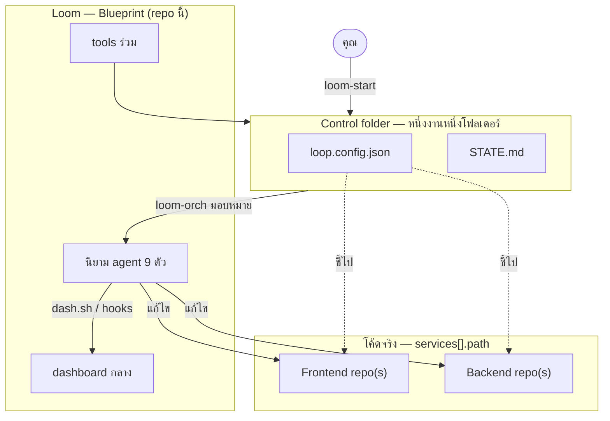
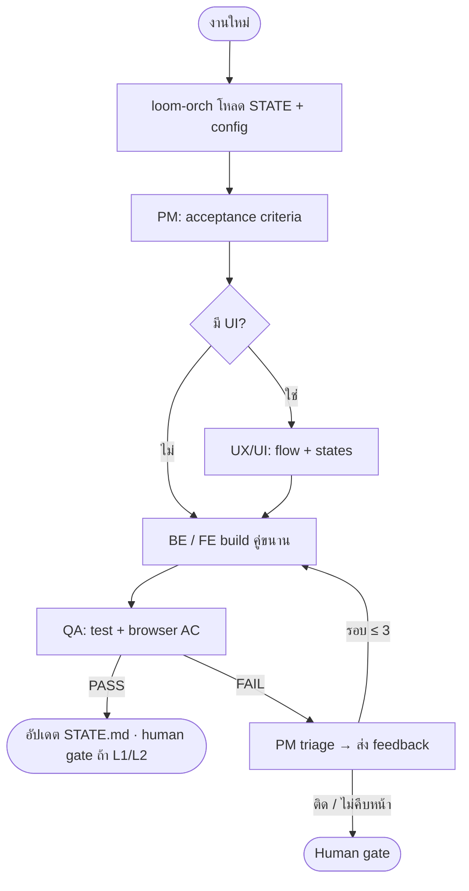

<p align="center">
  
</p>

<h1 align="center">Loom</h1>

<p align="center"><strong>AI Agent Software Team</strong> — พิมพ์เขียวกลางสำหรับ loop วางแผน → สร้าง → ตรวจ</p>

<p align="center"><em>เก้าตัวแทน หนึ่งเส้นด้าย ทอ loop จนส่งงานได้</em></p>

<p align="center">
  
  
  
</p>

> **ภาษา:** [English](README.md) · **ไทย** (เอกสารนี้)
>
> **Workspace:** clone หรือเปิด repo นี้ชื่อ **`loom`** (พิมพ์เขียว — ไม่ใช่โค้ดแอป)

ทีม **AI agent 9 ตัว** ทำงานเป็น **loop** (วางแผน → สร้าง → ตรวจ → วน) ใช้ได้ทั้ง **Claude Code · Cursor · Hermes**

> repo นี้คือ **พิมพ์เขียว (Base)** — ไม่ใช่ที่เก็บโค้ดงานจริง
> โค้ดจริงอยู่ที่ `services[].path` ใน `loop.config.json` (relative หรือ absolute)
> โฟลเดอร์ control (config + STATE) ถูกสร้างที่ `<base-dir>/<name>` ดีฟอลต์ `~/Documents/coding/agent-build`

**อัปเดตล่าสุด (2026-07-01):** เลือก platform + model ต่อ agent — ดู [What's new](#whats-new-2026-07-01)

**ทำไมชื่อ Loom?** แนวเดียวกับ Hermes (ส่งงาน) หรือ Ponytail (โค้ดน้อยที่สุด) — **Loom** คือที่ *ทอ* loop ซอฟต์แวร์: วางแผน → สร้าง → ตรวจ → วนใหม่ ด้วยทีม agent บนเส้นด้ายเดียว ชื่อสั้นของพิมพ์เขียว; แอปจริงยังอยู่ที่ control folder และ service path

## What's new (2026-07-01)

เลือก **editor + model ครั้งเดียว** ตอน `loom-start` — ทุก agent ใช้ค่าเดียวกัน (`loom-orch` ส่ง `model` ตอน delegate)

| | |
| --- | --- |
| **`agent_platform`** | `auto` (detect Cursor / Claude Code / Hermes) · `cursor` · `claude` · `hermes` |
| **`agent_models`** | model id แยกตาม platform — ดู [tools/agent-models.json](tools/agent-models.json) |
| **ค่า default** | Cursor `composer-2.5` · Claude Code `sonnet` · Hermes `inherit` |

**tools ใหม่:** `agent-models.json` · `resolve-agent-model.js` · `apply-agent-model.sh`

**หลัง `git pull`:**

```zsh
zsh tools/refresh.sh                    # sync agents ไป Claude / Cursor / Hermes
# Reload Cursor: Cmd+Shift+P → Developer: Reload Window
Use loom-start                          # open existing → model gate (โปรเจกต์เก่า)
# หรือแก้ loop.config.json แล้วจาก control folder:
zsh "$(cat ~/.loop-base)/tools/apply-agent-model.sh"
```

config เก่าที่มีแค่ `"model": "…"` → ถือเป็น `agent_models.cursor` · Hermes ที่ไม่ใช่ `inherit` → `hermes -m "<id>"`

## Quick start — Claude Code

**Clone แล้วใช้ได้เลย** (ไม่ต้องรัน `deploy.sh` เอง — ครั้งแรกที่ `./loom` จะลงทะเบียนให้อัตโนมัติ):

```zsh
git clone <repo-url> loom
cd loom
./loom wrap claude
```

ครั้งแรกจะเขียน `~/.loop-base` · ติดตั้ง CLI `loom` · sync agents (Claude Code · Cursor · Hermes) · ต่อ dashboard hooks — `git pull` refresh hooks อัตโนมัติ

**ติดตั้งเต็ม (ทางเลือก)** — external skills + เปิด dashboard:

```zsh
zsh tools/deploy.sh
```

**ทุกครั้งที่ใช้งาน — จากโฟลเดอร์ไหนก็ได้บนเครื่อง:**

```zsh
loom wrap claude
```

แสดง banner LOOM + path blueprint แล้วเปิด **Claude Code โดย cwd = blueprint** สตาร์ท dashboard ก่อน แล้ว **`--agent loom-start`** + ข้อความแรก **`Use loom-start`** ข้ามด้วย `LOOM_WRAP_NO_START=1`

<p align="center">
  
</p>

<p align="center">
  <em><code>loom wrap claude</code> → Claude เรียก <code>loom-start</code> ให้ · <code>loom where</code> ดูสถานะ blueprint · dashboard ที่ <code>http://localhost:19000</code></em>
</p>

### ดู dashboard

`loom wrap claude` สตาร์ท board กลางใน background เปิดซ้ำได้ตลอด:

```zsh
loom where          # path blueprint + โปรเจกต์ active
loom dash serve     # เปิด http://localhost:19000
```

<p align="center">
  <picture>
    <source srcset="assets/loom-dashboard-show.gif" type="image/gif">
    
  </picture>
</p>

<p align="center">
  <em>Live board — pixel office + Loop Activity. Office UI จาก <a href="https://github.com/ringhyacinth/Star-Office-UI">Star-Office-UI</a>.</em>
</p>

> **Warp terminal:** โหมด Agent อาจ autodetect บรรทัดนี้เป็น AI prompt แล้วแปลงเป็น `/agent loom …` (ใช้ credits ของ Warp แทนรัน CLI) บังคับให้รันเป็น shell ด้วย prefix `!` หรือกด **`Cmd+I`** สลับเป็น Terminal mode ก่อน:
>
> ```zsh
> !loom wrap claude
> ```
>
> ทางเลือก: **Settings → Agents → Warp Agent → Input** — ปิด autodetect หรือเพิ่ม `loom` ใน natural-language denylist

ในแชต Claude Code (ปกติ **ไม่ต้องพิมพ์เอง** — `loom wrap claude` เรียก `loom-start` ให้แล้ว):

```
Use loom-start
```

ผ่าน Step 0–4 (dashboard · base folder · control folder · lock เป้า) แล้วส่งต่อ:

```
Use loom-orch at L1: <อธิบาย feature หรือ bug>
```

ไม่ต้อง `cd` เข้าโปรเจกต์ — `loom-orch` อ่าน `.active-project` จาก blueprint เมื่อ cwd ไม่มี `loop.config.json`

| คำสั่ง | ทำอะไร |
| ------ | ------ |
| `loom where` | path blueprint · โปรเจกต์ active · `loom wrap claude` → `Use loom-start` (auto) |
| `loom start` | wizard ในเทอร์มินัล — flow เดียวกับ `Use loom-start` |
| `loom dash serve` | dashboard agent กลาง (`:19000`) |

**ติดตั้งไว้แล้ว?** หลัง `git pull` hooks จะ refresh อัตโนมัติ — ถ้าย้ายโฟลเดอร์ repo ให้รัน `zsh tools/refresh.sh` ครั้งเดียว (หรือ `./loom where`)

→ ติดตั้งเต็ม (Cursor · Hermes · skills): [เริ่มต้นใช้งาน](#เริ่มต้นใช้งาน)

---

## สถาปัตยกรรม 3 ชั้น

| อะไร | **Base** (repo นี้) | **Control folder** (`<base-dir>/<name>`) |
| ---- | -------------------- | ---------------------------------------- |
| **บทบาท** | พิมพ์เขียว — ใช้ร่วมทุกงาน | หนึ่งงาน — มีแค่ config + memory |
| **ทีม agent** | `.claude/agents/` | — (ติดตั้งระดับเครื่องผ่าน `deploy.sh`) |
| **Hermes skills** | `hermes-skills/` | — |
| **tools ร่วม** | `tools/` | — (เรียก Base ผ่าน `~/.loop-base`) |
| **Dashboard** | `agent-dashboard/` | — |
| **config งาน** | — | `loop.config.json` — services, mode, autonomy |
| **ความจำ loop** | — | `STATE.md` — ต่อ session ได้ |
| **โค้ดแอป** | — | `services[].path` — อาจอยู่ที่อื่นบนดิสก์ |

| ชั้น | ตำแหน่ง | เนื้อหา |
| ----- | -------- | -------- |
| **Base** | repo นี้ | นิยาม agent, tools, dashboard, LOOP.md — **ไม่คัดลอกไปปลายทาง** |
| **control folder** | `<base-dir>/<name>` | `loop.config.json` + `STATE.md` เท่านั้น |
| **โค้ดจริง** | ตาม `services[].path` | frontend / backend ที่ agent แก้ (อาจเป็น repo แยก) |

**กฎสำคัญ**
- ห้ามสร้างโปรเจกต์หรือเขียน `loop.config.json` ใน Base / โฟลเดอร์ปัจจุบัน
- agent ติดตั้งระดับเครื่อง (`~/.claude/agents`, `~/.hermes/skills`) → ใช้ได้จากทุกโปรเจกต์
- tools + dashboard หา Base ผ่าน `~/.loop-base` (เขียนโดย `deploy.sh` หรือ `new-project.sh`)
- 1 งาน = 1 control folder = 1 session แยกได้
- `.active-project` ใน Base เก็บ path ของ control folder ที่ active (`loom-start` เขียนให้)

**กำหนด base folder เอง** ผ่าน `loom-start` หรือ env `BASE_DIR=/path`
ลำดับการ resolve: arg > `BASE_DIR` > ไฟล์ `.base-dir` ใน Base > ดีฟอลต์ `~/Documents/coding/agent-build`
ต้องเป็น absolute path และอยู่นอก Base

### โฟลเดอร์ base กับ control folder

| | **base folder** | **control folder** |
| - | --------------- | ------------------ |
| **คำถาม** | **งานทั้งหมด** อยู่ที่ไหน? | เปิด **งานไหน** ในนั้น? |
| **ตัวอย่าง path** | `~/Documents/coding/agent-build` | `~/Documents/coding/agent-build/shop` |
| **เนื้อหา** | "ชั้นวาง" หลายงาน (ไม่มี config) | `loop.config.json` + `STATE.md` ของงานนั้น |
| **จำนวน** | มักมี **หนึ่ง** ต่อเครื่อง | **หลาย** งาน — งานละโฟลเดอร์ |
| **services** | N/A | control เดียวมี **หลาย service** ใน config เดียวได้ |

```
Use loom-start / /loom-start

Step 1 — base folder (ชั้นวางงาน)
  ถาม path → สร้างด้วย mkdir -p ถ้ายังไม่มี
  ~/Documents/coding/agent-build/          ← ★ สร้าง base folder ที่นี่ (ถ้ายังไม่มี)

Step 2 — control folder (งานเดียว)
  2a เปิดของเดิม → ไม่สร้างโฟลเดอร์ใหม่ (เลือกจากรายการใต้ base)
  2b สร้างใหม่   → ★ สร้าง control folder + loop.config.json + STATE.md
    ├── shop/          ← control job A
    ├── portal/        ← control job B
    └── my-app/        ← control job C

Step 3 — lock เป้า (.active-project ใน Loom) — ไม่สร้างโฟลเดอร์
```

| ขั้น `loom-start` | สร้างอะไร? | ตัวอย่าง |
| ----------------- | ---------- | -------- |
| **Step 1** | **base folder** (ถ้ายังไม่มี) | `mkdir -p ~/Documents/coding/agent-build` |
| **Step 2a** เปิดของเดิม | ไม่สร้าง — เลือก control ที่มี config แล้ว | เลือก `shop/` จากรายการ |
| **Step 2b** สร้างใหม่ | **control folder** + `loop.config.json` + `STATE.md` | `mkdir -p …/agent-build/shop` แล้วเขียน config |
| **Step 3** | `.active-project` ใน Loom (Blueprint) เท่านั้น | ไม่สร้างโฟลเดอร์งาน |

> **Blueprint (Base = repo Loom นี้)** ไม่ได้สร้างโดย `loom-start` — clone repo แล้ว `./loom` ครั้งแรกจะ bootstrap ให้ (หรือ `zsh tools/deploy.sh` สำหรับติดตั้งเต็ม)

**base ส่งผลต่อ control อย่างไร**

| หัวข้อ | base มีผล? |
| ----- | ------------- |
| สร้าง control folder ใหม่ | ใช่ — เสมอ `<base>/<job-name>/` |
| แสดงรายการงานใน `loom-start` | ใช่ — สแกน `base/*/loop.config.json` |
| เนื้อหา `loop.config.json` | ไม่ — services / mode / path อยู่ใน control ไม่ผูกกับ base |
| path **relative** ของ service | ไม่ — resolve จาก **control folder** ไม่ใช่ base |
| path **absolute** ของ service | ไม่ — ชี้ไปที่ไหนบนดิสก์ก็ได้ |
| เปลี่ยน base ทีหลัง | งานเก่าไม่ย้าย — control อยู่ path เดิม |

> **control folder ≠ 1 service** — control เดียวลิสต์หลาย service (เช่น frontend + api) ใน `loop.config.json` เดียวได้

---

## การทำงาน (ภาพรวม)

### โครงสร้างระบบ



### วง loop (หนึ่งรอบ)



### ข้อมูลไหลเข้า dashboard

ออฟฟิศพิกเซลมาจาก **[Star-Office-UI](https://github.com/ringhyacinth/Star-Office-UI)** (vendored ที่ `agent-dashboard/star-office/`) Loom เพิ่ม bridge และ activity feed ทับอีกชั้น


---

### ตัวอย่าง: โค้ดอยู่ที่หนึ่ง control อยู่อีกที่

สมมติ repo เก่าอยู่ใต้ `~/Documents/coding/legacy/` (โค้ดไม่ย้าย):

```
~/Documents/coding/legacy/              ← โค้ดจริง (ไม่ใช่ base ไม่ใช่ control)
├── shop-frontend/
├── shop-core/
├── portal-client/
├── portal-core/
└── portal-data/
```

ตั้ง **base** = `~/Documents/coding/agent-build` สร้าง **control** ต่องาน:

```
~/Documents/coding/agent-build/
├── shop/                               ← control job A
│   ├── loop.config.json                ← 2 services ชี้กลับ legacy/
│   └── STATE.md
└── portal/                             ← control job B
    ├── loop.config.json                ← 3 services ชี้กลับ legacy/
    └── STATE.md
```

`loop.config.json` ของงาน `shop` (`mode: existing` ไม่ย้ายโค้ด):

```json
{
  "project": "shop",
  "mode": "existing",
  "autonomy": "L1",
  "services": [
    { "id": "frontend", "side": "fe", "path": "~/Documents/coding/legacy/shop-frontend", "stack": "" },
    { "id": "core",     "side": "be", "path": "~/Documents/coding/legacy/shop-core",     "stack": "" }
  ]
}
```

งาน `portal` เป็นอีก control — สาม service ชี้ไป `portal-*` ใต้ `legacy/`

**ทำไมไม่รวม base + control + โค้ดในโฟลเดอร์เดียว?**

| แนวทาง | ผลลัพธ์ |
| -------- | ------ |
| control = โฟลเดอร์เดียวกับโค้ด (`legacy/loop.config.json`) | **งานเดียวเท่านั้น** — เขียน config เอง + `cd` ไปที่นั่น |
| หลายงานในโฟลเดอร์เดียว | **ไม่รองรับ** — มีได้แค่ `loop.config.json` + `STATE.md` เดียว (config/ความจำชนกัน) |
| แยก control ใต้ base (แนะนำ) | session คู่ขนาน สลับ `shop` / `portal` ผ่าน `cd` หรือ `loom-start` |

---

## เริ่มต้นใช้งาน

### 1) ติดตั้งทีม (ครั้งเดียวต่อเครื่อง) — รันจาก Base

```zsh
zsh tools/deploy.sh
```

คำสั่งแรกทำครบ:

| ขั้น | ทำอะไร |
| ---- | ------------ |
| **เสมอ** | ลงทะเบียน `~/.loop-base` · เปิด dashboard ที่ `:19000` |
| agents | คัดลอก subagent → `~/.claude/agents/` **ถ้า detect Claude ได้** |
| Hermes skills | ติดตั้ง team skills → `~/.hermes/skills/` **ถ้า detect Hermes ได้** |
| **external skills** | ที่แนะนำ → `~/.agents/skills/` (+ Hermes symlinks ถ้ามี Hermes) |
| dashboard hooks | auto-bridge ต่อแพลตฟอร์ม → `install-dash-hooks.sh` (ดูด้านล่าง) |
| L3 hook | auto-allow permission ของ Claude Code **ถ้า detect Claude ได้** |


**แพลตฟอร์มเป็นทางเลือก — `deploy.sh` ไม่ fail ถ้าไม่มีตัวใดตัวหนึ่ง**

ตัวติดตั้งจะ detect สิ่งที่มีบนเครื่องแล้ว **ข้ามส่วนที่ไม่มี** (exit 0 แสดง `(skip Cursor hooks …)` เป็นต้น) ใช้ **แค่ Claude Code อย่างเดียว, แค่ Cursor, หรือแค่ Hermes** ได้


| แพลตฟอร์ม | detect เมื่อ | `deploy.sh` ติดตั้ง | ถ้าไม่มี |
| --------- | ------------ | ------------------- | -------- |
| **Claude Code** | มี CLI `claude` **หรือ** `~/.claude/settings.json` | `~/.claude/agents/` · CC hooks · L3 hook | ข้าม — ไม่ error |
| **Cursor** | มี CLI `cursor` **หรือ** โฟลเดอร์ `~/.cursor/` | hooks ใน `~/.cursor/hooks.json` | ข้าม — ไม่ error |
| **Hermes** | มี `~/.hermes/config.yaml` (รัน `hermes setup` ก่อน) | team skills · shell hooks · allowlist | ข้าม — ไม่ error |

Cursor อ่าน agent จาก **`.claude/agents/` ใน repo นี้** เมื่อเปิดโฟลเดอร์ — ไม่ต้อง copy global

**เพิ่มแพลตฟอร์มทีหลัง** (เช่น ใช้ Cursor ก่อน แล้วค่อยลง Hermes):

```zsh
hermes setup                              # ครั้งเดียว ถ้าเพิ่ม Hermes
zsh tools/deploy.sh                       # หรือ: zsh tools/install-dash-hooks.sh
zsh tools/sync-agents.sh                  # refresh Hermes skills ถ้าต้องการ
```

Restart **Claude Code / Cursor / Hermes** หลังเปลี่ยน hooks

**หลัง `git pull`:** refresh อัตโนมัติผ่าน git hook — หรือรัน `zsh tools/refresh.sh` เอง


ข้าม external skills (ไม่มีเน็ต / ติดตั้งทีหลัง):

```zsh
DEPLOY_SKIP_EXTERNAL_SKILLS=1 zsh tools/deploy.sh
```

ติดตั้ง external skills ทีหลังหรือลองใหม่หลังข้าม:

```zsh
zsh tools/install-external-skills.sh && zsh tools/install-hermes-skills.sh
```

**External skills ที่ deploy ติดตั้ง**

| skill | ใช้โดย | วัตถุประสงค์ |
| ----- | ------- | ------- |
| `solid` | fe, be | SOLID, TDD, clean code |
| `ponytail` | fe, be | โค้ดน้อยที่สุดที่ใช้ได้ |
| `ponytail-review` | fe, be | รีวิว over-engineering / legacy orient |
| `ponytail-audit` | loom-orch | สแกนหนี้เทคนิคทั้ง service (เมื่อจำเป็น) |
| `postgres-best-practices` | loom-full-stack | DB / Postgres |
| `docker-containerization` | ทุก agent | [ailabs-393/ai-labs-claude-skills](https://skills.sh/ailabs-393/ai-labs-claude-skills/docker-containerization) |
| `hexagonal-architecture` | be, loom-full-stack | Ports & Adapters — [affaan-m/ECC](https://github.com/affaan-m/ECC) |
| `threejs-animation` | loom-motion | 3D / motion |
| `loom-me` | loom-pm | Workflow grilling — [mattpocock/loop-me](https://github.com/mattpocock/skills/tree/main/skills/in-progress/loop-me) |
| `ui-ux-pro-max` | loom-ux-ui | [nextlevelbuilder/ui-ux-pro-max-skill](https://github.com/nextlevelbuilder/ui-ux-pro-max-skill) |
| `perf-lighthouse` | qa, fe | ตรวจประสิทธิภาพเว็บ |
| `qa-browser` | qa | ทดสอบ FE/UI บนเบราว์เซอร์จริง |

หลังแก้นิยาม agent ให้ sync ทุกแพลตฟอร์ม:

```zsh
zsh tools/sync-agents.sh    # source = .claude/agents/
```

> **⚠ ย้ายโฟลเดอร์ Loom หลัง `deploy.sh`**
>
> การติดตั้งเขียน **absolute path** ลงเครื่อง — ไม่ relative ตาม git:
>
> | อะไร | อยู่ที่ |
> | ---- | ------ |
> | ตัวชี้ Base | `~/.loop-base` |
> | Dashboard hooks (Claude Code) | `~/.claude/settings.json` → `cc-dash-bridge.js` |
> | Dashboard hooks (Cursor) | `~/.cursor/hooks.json` → `dash-bridge.js` |
> | L3 auto-approve (ทางเลือก) | `~/.claude/settings.json` → `l3-permission-hook.js` |
> | Hermes shell hooks | `~/.hermes/config.yaml` → `dash-bridge.js` |
>
> ถ้า **ย้ายหรือเปลี่ยนชื่อ** repo `loom` (เช่น Desktop → Documents) path เหล่านี้จะพัง
> อาการ: dashboard เงียบ, `dash.sh serve` ล้ม, Claude hooks ไม่ทำงาน, project tag ผิดหรือไม่ขึ้น
>
> **แก้** — จากตำแหน่ง Loom **ใหม่**:
>
> ```zsh
> cd /path/to/loom
> zsh tools/deploy.sh
> ```
>
> แล้ว **restart Claude Code, Cursor และ/หรือ Hermes** ให้โหลด hooks ใหม่
>
> `git pull` จะ refresh hooks อัตโนมัติ — หลังย้ายโฟลเดอร์ให้รัน `zsh tools/refresh.sh` (หรือ `./loom where`)
>
> control folder ใต้ `agent-build/` และโค้ดโปรเจกต์จริง **ไม่โดนกระทบ** — มีแค่การติดตั้ง blueprint บนเครื่องนี้

### 2) เริ่มงาน — คำสั่งแชต (หลัก)

**งานใหม่หรือต่อโปรเจกต์เดิม** — คำสั่งเดียวกัน ไม่ต้อง `cd` เองถ้าอยู่ใน Base:

```
Use loom-start      ← Claude Code / Cursor
/loom-start         ← Hermes
```

`loom-start` / `/loom-start` พาไล่ทีละขั้น (ดู [base กับ control](#โฟลเดอร์-base-กับ-control-folder)):

| ขั้น | คำสั่ง | สร้างอะไร |
| ---- | ------ | --------- |
| **1** | `Use loom-start` / `/loom-start` → ถาม path | **base folder** — `mkdir -p` ถ้ายังไม่มี (ดีฟอลต์ `~/Documents/coding/agent-build`) |
| **2a** | เลือก **(1) open existing** | **ไม่สร้าง** — เลือก control folder ที่มี `loop.config.json` แล้ว |
| **2b** | เลือก **(2) create new** → ชื่องาน, mode, services | **control folder** ที่ `<base>/<job-name>/` + `loop.config.json` + `STATE.md` |
| **3** | lock เป้า | เขียน `.active-project` ใน Loom — ไม่สร้างโฟลเดอร์ |
| **4** | hand off | ส่งต่อ `loom-orch` |

รายละเอียดย่อ:
1. **Step 1** — base folder (ชั้นวาง) — สร้างโฟลเดอร์ชั้นวาง **ถ้ายังไม่มี**
2. **Step 2** — control folder — **2a** เปิดของเดิม (ไม่สร้าง) · **2b** สร้างใหม่ → `<base>/<job-name>/`
3. **(2b เท่านั้น)** mode (`new` / `existing`), autonomy (L1/L2/L3), services (id / side / path / stack)
4. เขียน/ยืนยัน `loop.config.json` + `STATE.md` ที่ control folder แล้วส่งต่อ `loom-orch`

> `loom-start` เลือกโปรเจกต์ที่ถูกก่อนเริ่มงานเสมอ
> `loom-orch` เช็ก `loop.config.json` ใน cwd ก่อน ถ้าไม่มีจะอ่าน `.active-project` (กันแก้ผิดโปรเจกต์)

รายละเอียดต่อ session เดิม → [ต่อ session เดิม](#ต่อ-session-เดิม--เปิดโปรเจกต์ที่ตั้งค่าไว้แล้ว)

จากนั้นมอบหมายงาน:

```
Use loom-orch at L1: <อธิบายฟีเจอร์หรือบั๊ก>
```

Hermes: `/loom-orch run at L1: <task>`

`loom-orch` จะถาม **「เปิด dashboard ดู agent ทำงานไหม? [Y/n]」** (ดีฟอลต์ Y) ก่อนส่งงานให้ agent ใด ๆ — ตอบ Y หรือ Enter แล้วเปิด browser ที่ `http://localhost:19000` อัตโนมัติ

### 3) ทางเลือกผ่าน terminal

```zsh
zsh tools/deploy.sh                  # ติดตั้งทีม (ครั้งเดียวต่อเครื่อง)
zsh tools/loom-start.sh              # wizard Steps 1–4 (base → control → lock → hand off)
zsh tools/new-project.sh my-app      # shortcut: Step 1 + 2b (--new)
zsh tools/dash.sh serve              # เปิดกระดานกลาง (Star-Office)
```

`new-project.sh` สร้าง control folder ที่ base — **ไม่คัดลอก tools/** (มีแค่ `STATE.md`)
แล้วรัน `init-config.sh` จาก Base เพื่อถาม services

### อยู่ใน Base ได้ไหม?

รายละเอียดต่อ session → [ต่อ session เดิม](#ต่อ-session-เดิม--เปิดโปรเจกต์ที่ตั้งค่าไว้แล้ว)

| การกระทำ | ทำจาก Base ได้? | หมายเหตุ |
| ------ | ------------- | ----- |
| `Use loom-start` / `Use loom-orch` | ได้ | ใช้ `.active-project` หรือ skill ปักเป้า |
| `node cfg.js`, `verify-paths`, `scaffold` | ไม่ได้ | ต้อง `cd` เข้า control folder (tools อ่าน config จาก cwd) |
| `dash.sh serve` / `where` | ได้ | กระดานกลาง ไม่ผูก cwd |
| `dash.sh set/reset/log` | ได้ | จาก Base ได้ — resolve ชื่อโปรเจกต์จาก `.active-project` (ไม่ tag `(unknown)`) |

---

## ทีม agent

| ชื่อ | บทบาท | ทำอะไร |
| ---- | ---- | ---- |
| `loom-start` | Bootstrap | เริ่มที่นี่ — เลือก/สร้างโปรเจกต์ + เขียน `loop.config.json` ส่งต่อ loom-orch |
| `loom-orch` | Orchestrator | อ่าน `STATE.md` + `loop.config.json` มอบหมายทีม รัน loop |
| `loom-pm` | Product | แตก AC · **นำ triage** เมื่อ QA FAIL · workflow grilling ผ่าน **loom-me** |
| `loom-ux-ui` | UX/UI | UX/UI flow ทุก state ก่อน FE · design intelligence ผ่าน **ui-ux-pro-max** |
| `loom-fe` | Frontend | UI ต่อ API ทุก state |
| `loom-motion` | Frontend Motion | animation, Three.js/WebGL |
| `loom-be` | Backend | API, business logic, data layer |
| `loom-full-stack` | Fullstack (BE specialist) | ออกแบบ DB, security, escalation ด้าน backend ลึก |
| `loom-qa` | QA | AC → PASS/FAIL · FE/UI ผ่าน **`qa-browser`** (browser-use) |

**วง feedback:** QA FAIL → PM triage → ส่งกลับ `fe`/`be`/… → แก้ → QA ทดสอบใหม่ (สูงสุด 3 รอบ) — บันทึกใน `STATE.md` → `## Feedback history`

**`qa-browser`** รวมใน `zsh tools/deploy.sh` — ดู [ขั้น 1](#1-ติดตั้งทีม-ครั้งเดียวต่อเครื่อง--รันจาก-base)

สเปก loop เต็ม → [LOOP.md](LOOP.md) · อ้างอิง: [Loop Engineering Guide 2026](https://tosea.ai/blog/loop-engineering-ai-agents-complete-guide-2026)

---

## แพลตฟอร์ม (Claude Code · Cursor · Hermes)

| | Claude Code | Cursor | Hermes |
| - | ----------- | ------ | ------ |
| รูปแบบทีม | subagents | `.claude/agents` + Custom Modes | SKILL.md (slash) |
| ติดตั้ง | `zsh tools/deploy.sh` | เปิดโฟลเดอร์ | `zsh tools/deploy.sh` |
| เริ่ม | `Use loom-start` | `Use loom-start` | `/loom-start` |
| เรียก agent | `Use loom be to ...` | แชต / Custom Mode | `/loom-be`, `/loom-qa`, … |
| งานคู่ขนาน | เต็มที่ (worktree) | จำกัด | ได้ (subagents) |
| อัตโนมัติ/cron | ผ่าน loop | — | ในตัว |
| จุดเด่น | loop เต็มรูปแบบ | แก้/รีวิวด้วยมือ | headless + ตั้งเวลา |
| Dashboard hooks | `~/.claude/settings.json` | `~/.cursor/hooks.json` | `~/.hermes/config.yaml` |
| จำเป็นสำหรับ Loom | ทางเลือก (มีอย่างใดอย่างหนึ่ง) | ทางเลือก | ทางเลือก |

### Dashboard auto-bridge (ทุกแพลตฟอร์ม)

คำสั่งเดียวเชื่อมทุกแพลตฟอร์มที่ **detect ได้** กับกระดานกลาง (`http://localhost:19000`):

```zsh
zsh tools/install-dash-hooks.sh   # รวมใน deploy.sh — ข้ามแพลตฟอร์มที่ไม่มี
```

| แพลตฟอร์ม | ไฟล์ / config | สิ่งที่สะท้อนไป board |
| --------- | ------------- | --------------------- |
| Claude Code | `~/.claude/settings.json` | แก้ไฟล์ · shell ที่มี label · สรุป sub-agent / จบ session |
| Cursor | `~/.cursor/hooks.json` | ด้านบน + `afterFileEdit` · `afterShellExecution` · assistant response |
| Hermes | `~/.hermes/config.yaml` | `write_file` / `patch` / `terminal` · sub-agent stop · จบ turn (`post_llm_call`) |

ชื่อโปรเจกต์ resolve จาก `loop.config.json` ใน cwd, walk ขึ้นหาโฟลเดอร์แม่, หรือ `.active-project` ใน Loom — ไม่ tag `(unknown)`

shell แสดงเฉพาะ **label ที่อ่านง่าย** (เช่น `npm test`) — ไม่ dump คำสั่ง debug

สรุป loop ยาว ๆ ยังควร `dash.sh report` / `say` บนทุกแพลตฟอร์ม

หลังติดตั้ง → **restart** IDE หรือ Hermes · gateway/cron ใช้ `hermes --accept-hooks` หรือ `hooks_auto_accept: true` (allowlist ถูก pre-approve ตอน install)


### Claude Code

`deploy.sh` คัดลอก subagent ไป `~/.claude/agents/` เมื่อ detect Claude ได้ — ใช้ได้ทุกโปรเจกต์ทันที

```
Use loom-start
Use loom-orch at L1: ...
Use loom be to ...
Use loom qa to ...
```

**ความสามารถ:** subagent แท้ — worktree คู่ขนาน ส่งต่อ context autonomy L1–L3 ประสบการณ์ loop เต็มที่สุด

### Cursor

เปิดโฟลเดอร์ — Cursor อ่าน `.claude/agents/` อัตโนมัติ
persona เสริม (ทางเลือก): Settings → Custom Modes → วางแต่ละ `.claude/agents/*.md`

แชตเหมือน Claude Code (`Use loom-orch at L1: ...`) หรือสลับ Custom Modes

**ความสามารถ:** ดีสำหรับแก้แบบโต้ตอบ งานขนานน้อยกว่า Claude Code เหมาะแก้/รีวิวด้วยมือ

### Hermes

เมื่อ detect Hermes ได้ `deploy.sh` ติดตั้ง team skills (`loom-start loom-orch loom-pm loom-ux-ui loom-fe loom-motion loom-be loom-full-stack loom-qa LOOM`)
ไป `~/.hermes/skills/` พร้อม symlink external skills

```
/loom-start
/loom-orch
/loom-be
/loom-qa
```

รวม skills เป็น bundle:

```zsh
hermes bundles create backend-dev -s be -s loom-full-stack -s postgres-best-practices
hermes bundles create frontend-dev -s fe -s loom-motion -s solid
```

> **ชนชื่อ `qa`:** team agent `qa` กับ browser-use skill `qa` → ตัวติดตั้งเปิดเป็น **`qa-browser`** ใน Hermes

**ความสามารถ:** autonomous/headless, cron, หลายช่องทาง เหมาะ loop ตามเวลา ต้องรันใน/ชี้ control folder ที่ถูก

> ทั้งสามแพลตฟอร์มอ่าน `loop.config.json` จาก **โฟลเดอร์ที่คุณอยู่** เริ่มด้วย `loom-start` เพื่อปักโปรเจกต์ที่ถูก **ไม่จำเป็นต้องมีครบทั้งสาม** — เลือกอย่างใดอย่างหนึ่งก็พอ

---

## loop.config.json

ห้ามสร้างใน Base — `loom-start` หรือ
`zsh "$(cat ~/.loop-base)/tools/init-config.sh"` (จาก control folder) พาไล่ให้
งานเดียวมีหลาย service ได้ **แต่ละ service อยู่ base path ของตัวเองได้**

```json
{
  "project": "my-app",
  "mode": "new",
  "autonomy": "L1",
  "agent_platform": "auto",
  "agent_models": {
    "cursor": "composer-2.5",
    "claude": "sonnet",
    "hermes": "inherit"
  },
  "improvement_policy": "guided",
  "services": [
    { "id": "web",     "side": "fe", "path": "web",                        "stack": "nextjs" },
    { "id": "admin",   "side": "fe", "path": "apps/admin",                 "stack": "vite-react" },
    { "id": "api",     "side": "be", "path": "api",                        "stack": "nestjs" },
    { "id": "billing", "side": "be", "path": "/Users/me/work/billing-svc", "stack": "node-express" }
  ]
}
```

### Agent platform & models

ตั้ง **ครั้งเดียวตอน `loom-start`** — ทุก agent ใน loop ใช้ค่าเดียวกัน

| ฟิลด์ | ความหมาย |
| ----- | ------- |
| `agent_platform` | `auto` = detect Cursor / Claude Code / Hermes · หรือล็อกเป็น `cursor` \| `claude` \| `hermes` |
| `agent_models` | model id แยกตาม platform — ดู [tools/agent-models.json](tools/agent-models.json) |
| `agent_model` | ตัวย่อเมื่อ `agent_platform` ไม่ใช่ `auto |

**ค่า default:** Cursor `composer-2.5` · Claude Code `sonnet` · Hermes `inherit`

```zsh
B="$(cat ~/.loop-base)"
node "$B/tools/resolve-agent-model.js"              # resolve ตาม editor ปัจจุบัน
node "$B/tools/resolve-agent-model.js" list cursor  # แสดงตัวเลือก Cursor
zsh "$B/tools/apply-agent-model.sh"               # sync → ~/.cursor/agents + ~/.claude/agents (จาก control folder)
```

config เก่าที่มีแค่ `"model": "…"` จะถือเป็น `agent_models.cursor` — ดู [What's new (2026-07-01)](#whats-new-2026-07-01)

### ฟิลด์ `services[]`

| ฟิลด์ | ความหมาย | ตัวอย่าง |
| ----- | ------- | -------- |
| `id` | ชื่อสั้นไม่ซ้ำสำหรับคำสั่งเช่น `scaffold-all.sh api` | `web`, `admin`, `api`, `worker` |
| `side` | agent ไหนรับผิดชอบ | `fe` = frontend/UI (fe, loom-motion) · `be` = backend/API/data (be, loom-full-stack) |
| `path` | ตำแหน่งโค้ด — **relative** = ใต้ control folder · **absolute/`~`** = ที่ไหนก็ได้ | `web`, `apps/admin`, `~/Documents/coding/legacy/old-api` |
| `stack` | แม่แบบ scaffold | fe: `nextjs` `vite-react` `sveltekit` `astro` · be: `nestjs` `fastapi` `node-express` `go` · `""` = ไม่ scaffold |

### `mode`

| ค่า | ความหมาย |
| ----- | ------- |
| `new` | agent scaffold โฟลเดอร์ใหม่ตาม path ที่ให้ |
| `existing` | ใช้โค้ดเดิม — ไม่ scaffold (`stack` เป็น `""` ได้) |

### กฎ `path`

- **relative** (`web`, `apps/admin`) → `<control folder>/web` ฯลฯ
- **absolute** (`/Users/me/.../old-api`) → ใช้ตามนั้น ชี้ repo แยกได้
- **`~`** → ขยายเป็น home
- ผสม relative + absolute ใน config เดียวได้

ตรวจ path ที่ resolve แล้ว (จาก control folder):

```zsh
B="$(cat ~/.loop-base)"
node "$B/tools/cfg.js" resolved
node "$B/tools/cfg.js" abspath api
node "$B/tools/cfg.js" ids fe
```

### เพิ่ม service ทีหลัง

control folder สร้างครั้งเดียว — **`services[]` ขยายได้เรื่อย ๆ** ไม่ต้อง `loom-start` ใหม่

**วิธีเพิ่ม**

1. **แก้ `loop.config.json` เอง** — เพิ่ม object ใน `services[]` (ดูรูปแบบด้านบน)
2. **ผ่านแชต** — `Use loom-orch at L1: add service … to loop.config.json` (จาก control folder หรือ Loom + `.active-project`)

**อย่ารัน `init-config.sh` ซ้ำโดยไม่ระวัง** — wizard เขียนทับทั้งไฟล์ ไม่ merge service เดิม

**หลังเพิ่มแล้ว** (จาก control folder):

```zsh
B="$(cat ~/.loop-base)"
node "$B/tools/cfg.js" resolved
zsh "$B/tools/verify-paths.sh"
# mode: new + path relative ใหม่ → scaffold เฉพาะ service ที่เพิ่ม
zsh "$B/tools/scaffold-all.sh" admin
```

| หัวข้อ | หมายเหตุ |
| ----- | -------- |
| `id` | ต้องไม่ซ้ำใน config เดียวกัน |
| `path` relative | resolve จาก **control folder** |
| `path` absolute/`~` | ชี้ repo เก่าที่ไหนก็ได้ — ไม่ต้องย้ายโค้ด |
| `mode: existing` | เพิ่มแล้วใช้ได้เลย — `stack: ""` ได้ |
| `STATE.md` | ไม่ต้องแก้ — loop อ่าน config ใหม่ทุกครั้ง |

ตัวอย่างเต็ม → [loop.config.example.json](loop.config.example.json)

### พรอมต์ wizard — พิมพ์ `path` อย่างไร

เมื่อรัน `zsh tools/new-project.sh <name>` (จาก Base) หรือ
`zsh "$(cat ~/.loop-base)/tools/init-config.sh"` (ใน control folder) **`path`** รับสองรูปแบบ (`←` = สิ่งที่พิมพ์):

```text
-- new service --
  service id — short name, e.g. web/admin/api (blank = done): web        ←  service name
  side — fe (frontend/UI) or be (backend/API/data) [fe]:                  ←  Enter = fe
  path — relative (under this project) or absolute (its own base) [web]:  ←  Enter = "web" (subfolder under control)
  stack hint — fe: nextjs|... / be: ...|go [nextjs]:                      ←  Enter = nextjs

-- new service --
  service id ...: api
  side ... [fe]: be                                                       ←  type be
  path ... [api]: /Users/me/Documents/coding/legacy/old-api               ←  absolute = existing folder elsewhere
  stack ... [nestjs]:                                                     ←  Enter = nestjs (be default)

-- new service --
  service id ...:                                                         ←  blank Enter = done
```

ผลลัพธ์ — path ผสมใน config เดียว:

```json
"services": [
  { "id": "web", "side": "fe", "path": "web",                                     "stack": "nextjs" },
  { "id": "api", "side": "be", "path": "/Users/me/Documents/coding/legacy/old-api", "stack": "nestjs" }
]
```

### Legacy sync — ทำความเข้าใจโค้ดเดิมก่อน (`mode: existing`)

กับโค้ด legacy agent **ไม่มี context ก่อนหน้า** — `loom-orch` รัน **orientation (ขั้น 0b)** ก่อน clarify/build:

1. ระบุ **service ใน scope** จาก `loop.config.json` (ไม่สแกนทั้ง repo ถ้าไม่จำเป็น)
2. มอบหมาย maker (`loom-fe` / `loom-be` / `loom-full-stack`) **อ่านโครงสร้าง** — stack, entry point, test, convention
3. **`/ponytail-review`** บน **ไฟล์/โมดูลที่งานนี้จะแตะ** — over-engineering / ความเสี่ยง
4. **`/ponytail-audit`** — เมื่อจำเป็นเท่านั้น (โค้ดเบสใหญ่ หนี้บล็อก หรือผู้ใช้ขอ) จำกัดโฟลเดอร์ service ที่เกี่ยว
5. สรุปใน `STATE.md` → `## Project context` + `## Relevant areas for this task`

```
loom-orch: legacy orient — shop (fe+be)
  → fe explore shop-frontend → ponytail-review on components to change
  → be explore shop-core     → ponytail-review on relevant API layer
  → write STATE.md, then PM / build
```

ต้องมี `ponytail-review` / `ponytail-audit` — `deploy.sh` ติดตั้งให้ — ดู [ขั้น 1](#1-ติดตั้งทีม-ครั้งเดียวต่อเครื่อง--รันจาก-base)

### ระดับ autonomy

| ระดับ | ความหมาย |
| ----- | ------- |
| **L1 — report only** | วางแผน/เสนอ ไม่ commit — **เริ่มที่นี่** |
| **L2 — assisted** | maker เขียนใน worktree คุณรีวิวแล้ว merge |
| **L3 — unattended** | อัตโนมัติเต็มเมื่อไว้ใจ — safety denylist ใช้เสมอ |

**L3 ใน Claude Code — ไม่ต้องกด Yes ทุกคำสั่ง:** `autonomy: "L3"` ใน config อย่างเดียวไม่พอ — ติดตั้ง hook ครั้งเดียว:

```zsh
zsh tools/install-l3-hooks.sh          # จาก Loom blueprint
cd <control-folder> && zsh "$(cat ~/.loop-base)/tools/apply-l3-claude-settings.sh"
```

แล้ว **restart Claude Code** — compound `cd … && git …` จะ auto-allow (ยกเว้น denylist: force-push, `rm -rf`, `.env`, deploy)

ขยับขึ้นทีละระดับเมื่อระดับก่อนหน้า "น่าเบื่อ" (ไม่มีเซอร์ไพรส์) รายละเอียดใน [LOOP.md](LOOP.md)

---

## ตัวอย่าง: ห่อโฟลเดอร์เดิมเป็น services (`mode: existing`)

> โครงโฟลเดอร์ (`legacy/` + control ใต้ `agent-build/`) อยู่ [ด้านบน](#ตัวอย่าง-โค้ดอยู่ที่หนึ่ง-control-อยู่อีกที่) — ส่วนนี้เป็นขั้นตั้งค่าเต็ม

โค้ด legacy ใต้ `~/Documents/coding/legacy/` — ห่อโฟลเดอร์เป็นงาน
**โดยไม่ย้าย/คัดลอกโค้ด** — `path` absolute + `mode: existing`

> control folder ใหม่ใต้ base โค้ดจริงอยู่ที่เดิม
> 1 งาน = 1 control folder = session แยกได้

### งาน A — shop (2 services)

```zsh
zsh tools/new-project.sh shop          # control ใหม่ที่ base, wizard mode=existing
```

```json
{
  "project": "shop",
  "mode": "existing",
  "autonomy": "L1",
  "services": [
    { "id": "frontend", "side": "fe", "path": "/Users/me/Documents/coding/legacy/shop-frontend", "stack": "" },
    { "id": "core",     "side": "be", "path": "/Users/me/Documents/coding/legacy/shop-core",     "stack": "" }
  ]
}
```

### งาน B — portal session แยก (3 services)

```zsh
zsh tools/new-project.sh portal
```

```json
{
  "project": "portal",
  "mode": "existing",
  "autonomy": "L1",
  "services": [
    { "id": "client",      "side": "fe", "path": "/Users/me/Documents/coding/legacy/portal-client", "stack": "" },
    { "id": "core",        "side": "be", "path": "/Users/me/Documents/coding/legacy/portal-core",   "stack": "" },
    { "id": "data-client", "side": "be", "path": "/Users/me/Documents/coding/legacy/portal-data",   "stack": "" }
  ]
}
```

> `side` ส่งงานไป agent ที่ถูก (fe/loom-motion กับ be/loom-full-stack) — ปรับตามจริง
> `stack` เป็น `""` ได้สำหรับ existing (ไม่ scaffold)

ตรวจก่อนเริ่ม:

```zsh
cd ~/Documents/coding/agent-build/shop
B="$(cat ~/.loop-base)"
node "$B/tools/cfg.js" resolved
zsh "$B/tools/verify-paths.sh"
```

### ผ่าน skill — `/loom-start` หรือ `Use loom-start`

ไม่ต้องใช้ `zsh tools` — แชตทีละขั้น skill เขียน `loop.config.json` (existing + absolute paths) ที่ control folder

```text
You: Use loom-start                                    ← Step 1 เริ่ม
loom-start: Where should projects live? [~/Documents/coding/agent-build]
You: (Enter)                                           ← Step 1: ยืนยัน base (mkdir ถ้ายังไม่มี)
loom-start: Existing projects: (none) — (1) open existing  (2) create new
You: 2                                                 ← Step 2b: สร้าง control ใหม่
loom-start: Project name?
You: shop                                              ← ชื่อ control folder → …/agent-build/shop/
loom-start: mode? new = scaffold / existing = use code you already have
You: existing
loom-start: autonomy? [L1]
You: (Enter)
loom-start: Agent platform? (1) Auto  (2) Cursor  (3) Claude Code  (4) Hermes
You: 1                                                 ← agent_platform: auto
loom-start: Models per platform? [Cursor composer-2.5 · Claude sonnet · Hermes inherit]
You: (Enter defaults)
loom-start: service — id / side / path / stack (blank = done)
You: frontend · fe · ~/Documents/coding/legacy/shop-frontend · (blank)
You: core · be · ~/Documents/coding/legacy/shop-core · (blank)
You: (blank Enter = done)                              ← Step 2b: เขียน loop.config.json + STATE.md
loom-start: ✓ Active project → ~/Documents/coding/agent-build/shop   ← Step 3: .active-project
            wrote loop.config.json — next: Use loom-orch at L1: <task>
```

`loop.config.json` เหมือนงาน A ด้านบน

> ผลลัพธ์เดียวกัน: `new-project.sh`/`init-config.sh` (terminal) กับ `loom-start` (แชต)
> แพลตฟอร์มแชตอย่างเดียว (Hermes/Claude) → `/loom-start` สะดวกสุด

### ต่อ session เดิม — เปิดโปรเจกต์ที่ตั้งค่าไว้แล้ว

ความจำของ loop อยู่ใน `STATE.md` ของ control folder (`loop.config.json` ด้วย)
**ไม่ต้องสร้างใหม่** — ชี้กลับ control folder เดิม

#### วิธีหลัก — อยู่ใน Loom (ไม่ต้อง `cd` เอง)

เปิด Cursor/แชตใน **Loom** (repo พิมพ์เขียวนี้) แล้วพิมพ์:

```
Use loom-start
```

ตัวอย่างบทสนทนา:

```
You:        Use loom-start                            ← Step 1 เริ่ม
loom-start: Where should projects live?
You:        ~/Documents/coding/agent-build          ← Step 1: ยืนยัน base (mkdir ถ้ายังไม่มี)
loom-start: Found existing projects:
              1) shop   → .../agent-build/shop
              2) portal → .../agent-build/portal
            Open existing or create new?
You:        1                                          ← Step 2a: เปิด control เดิม (ไม่สร้างโฟลเดอร์)
loom-start: ✓ Active project → .../agent-build/shop   ← Step 3: .active-project
            read STATE.md — continue with:
            Use loom-orch at L1: <work to resume>
You:        Use loom-orch at L1: continue from STATE — fix checkout bug
```

`loom-start` / `/loom-start` จะ:
- **Step 1** — สร้าง **base folder** ถ้ายังไม่มี (`mkdir -p`)
- **Step 2a** — แสดง control ใต้ base ที่มี `loop.config.json` — **ไม่สร้างโฟลเดอร์ใหม่**
- **Step 2b** — สร้าง **control folder** + config (ข้าม wizard ไม่ได้)
- **Step 3** — เขียน `.active-project` ใน Loom ให้ `loom-orch` รู้งานที่ active

ทำต่อได้ทันที — **อยู่แชต Loom** เพราะ `loom-orch` อ่าน `.active-project` เมื่อ cwd ไม่มี config:

```
Use loom-orch at L1: <continue task>
```

Hermes: `/loom-orch run at L1: <task>`

#### เมื่อไหร่ต้อง `cd`?

| การกระทำ | ต้อง `cd`? |
| ------ | ---------- |
| `Use loom-start` / `Use loom-orch` ในแชต | **ไม่** — ใช้ `.active-project` |
| `verify-paths`, `scaffold`, `init-config`, `node cfg.js` | **ใช่** — tools อ่าน `loop.config.json` จาก cwd |
| `dash.sh serve` / `where` | **ไม่** — กระดานกลาง |
| `dash.sh set/reset/log` | แนะนำ `cd` เข้า control — จาก Base ใช้ `.active-project` แทน tag `(unknown)` |

แนะนำเปิดโฟลเดอร์ใน IDE — เปิด **control folder** เป็น workspace แล้ว `Use loom-orch` (cwd มี `loop.config.json`):

```zsh
# Optional — open control as Cursor workspace
# File → Open Folder → ~/Documents/coding/agent-build/shop
# chat: Use loom-orch at L1: <task>
```

หรือ `cd` ใน terminal สำหรับเครื่องมือ manual:

```zsh
cd ~/Documents/coding/agent-build/shop
B="$(cat ~/.loop-base)"
zsh "$B/tools/verify-paths.sh"
```

#### สลับงาน (`shop` ↔ `portal`)

รัน `Use loom-start` อีกครั้ง → เลือก control อื่น — หรือ `cd` แล้วเรียก orch
ทุกแพลตฟอร์มใช้ `loop.config.json` ของโปรเจกต์ที่ active — ไม่ปนกัน

#### เครื่องใหม่ / ยังไม่เคย deploy

ครั้งเดียวจาก Loom:

```zsh
zsh tools/deploy.sh    # register ~/.loop-base
```

จากนั้น `Use loom-start` ตามปกติ — control folder + `STATE.md` ยังอยู่บนดิสก์ตาม path เดิม

---

## กระดานสถานะ

กระดานกลางที่ Base (`agent-dashboard/`) — **ไม่คัดลอกไปปลายทาง**
ทุกโปรเจกต์/session รายงานที่นี่ แต่ละบรรทัด log มี tag ชื่อโปรเจกต์

### Show dashboard

<p align="center">
  
</p>

<p align="center">
  <em>กระดานสดที่ <code>http://localhost:19000</code> — ออฟฟิศพิกเซล + panel Loop Activity (diff ไฟล์, รายงาน, ประวัติ archive).</em><br>
  UI ออฟฟิศดัดแปลงจาก <a href="https://github.com/ringhyacinth/Star-Office-UI">Star-Office-UI</a> — ดู <a href="#เครดิตและขอบคุณ">เครดิตและขอบคุณ</a>
</p>

```zsh
# Open board (from anywhere)
zsh tools/dash.sh serve          # Star-Office pixel office → http://localhost:19000
zsh tools/dash.sh where          # central board path

# Report status (from control folder for correct project tag)
B="$(cat ~/.loop-base)"
zsh "$B/tools/dash.sh" reset "<task title>"           # new task (keeps cross-project history)
zsh "$B/tools/dash.sh" set orch work "planning" "received task"
zsh "$B/tools/dash.sh" set pm   done "AC ready"
zsh "$B/tools/dash.sh" set be   work "build /auth"
zsh "$B/tools/dash.sh" loop 2                     # QA sent work back, round 2
zsh "$B/tools/dash.sh" set qa   done "PASS all criteria"
```

**Activity feed ละเอียด** — ใครคุยกับใคร · skill อะไร · คำสั่งอะไร · กำลังทำอะไร:

```zsh
zsh "$B/tools/dash.sh" delegate orch pm "→ PM: write AC" activity="planning loop" skill=loom-orch
zsh "$B/tools/dash.sh" skill be ponytail activity="trimming auth handler"
zsh "$B/tools/dash.sh" cmd qa "npx playwright test" activity="regression" skill=qa-browser
zsh "$B/tools/dash.sh" event orch "route fixes" kind=delegate to=be cmd="Task be" activity="triage"
zsh "$B/tools/dash.sh" say fullstack title="ผลตรวจ core" kind=report --stdin <<'EOF'
TL;DR summary + decisions + PASS/FAIL here
EOF
```

คำสั่ง: `say` (บทความยาว/multiline) · `delegate` · `skill` · `cmd` · `event` · `log` · `set` · `clearlog`
feed เก็บ 400 บรรทัด (rolling) · archive รายวันใน `agent-dashboard/log-archive/` · panel **Loop Activity** มี Clear log + ดู archive

เปิดอัตโนมัติตอน `deploy.sh` · ตอนเริ่ม `loom-orch` จะถาม **「เปิด dashboard ดู agent ทำงานไหม? [Y/n]」** (default Y) แล้วเปิด browser ที่ `http://localhost:19000` — เรียกซ้ำได้ปลอดภัย

**Star-Office dashboard** (`agent-dashboard/star-office/`) — vendored จาก
**[Star-Office-UI](https://github.com/ringhyacinth/Star-Office-UI)** โดย [Ring Hyacinth](https://github.com/ringhyacinth) & [Simon Lee](https://x.com/simonxxoo)
โค้ด **MIT**; **asset ศิลปะใช้เรียนรู้แบบไม่เชิงพาณิชย์เท่านั้น** (ดู LICENSE ต้นทาง)
Loom เพิ่ม: `star-office-bridge.js`, panel Loop Activity, `dash-bridge.js` / `cc-dash-bridge.js` (Claude Code + Cursor → กระดาน), และคำสั่ง feed ใน `agent-status.js` (`file`, `report`, `wait`, …)
- `star-office-bridge.js` สะท้อน loop `status.json` → office + `activity.json` (`GET /activity`)
- panel **Loop Activity** แสดง delegate / skill / cmd / **say** (เต็มความยาว) · guest bubble จาก log จริง · ปุ่ม View ต่อข้อความ
- ตัวละคร 8 บทบาทในโซน (orch = หลัก คนอื่นเป็น guest)
- ป้าย office = ชื่อโปรเจกต์
- รันครั้งแรกสร้าง venv เล็ก + ติดตั้ง flask

---

## คำสั่งที่ใช้บ่อย

tools อยู่แค่ใน Base — รัน **จาก control folder** (ให้ tools อ่าน `loop.config.json` ใน cwd)
แต่ชี้สคริปต์ไป Base ผ่าน `~/.loop-base`:

```zsh
cd ~/Documents/coding/agent-build/my-app      # enter control folder first
B="$(cat ~/.loop-base)"                        # Base path (written by deploy.sh)

node "$B/tools/cfg.js" resolved      # services + resolved absolute paths
node "$B/tools/cfg.js" get project   # read scalar config value
node "$B/tools/cfg.js" abspath api   # absolute path for service id=api
zsh "$B/tools/verify-paths.sh"      # check folder access / prep create (mode new)
zsh "$B/tools/scaffold-all.sh"      # scaffold all services
zsh "$B/tools/scaffold-all.sh" api  # scaffold service id=api only
zsh "$B/tools/dash.sh" serve        # open central board
zsh "$B/tools/dash.sh" where        # central board path
```

รันจาก Base โดยตรง (ไม่มี config ใน cwd):

```zsh
zsh tools/deploy.sh                 # install team + register ~/.loop-base
zsh tools/loom-start.sh                 # wizard Steps 1–4
zsh tools/new-project.sh my-app       # shortcut: Step 1 + 2b
zsh tools/sync-agents.sh              # sync agent defs to all platforms
zsh tools/dash.sh serve               # open board
```

> ใช้ **chat skills** (`loom-start`, `loom-orch`, …) หรือ `zsh tools/*.sh` / `zsh "$B/tools/*.sh"`

---

## เครดิตและขอบคุณ

### Dashboard

<p align="center">
  <a href="https://github.com/ringhyacinth/Star-Office-UI">
    
  </a>
</p>

<p align="center">
  <strong><a href="https://github.com/ringhyacinth/Star-Office-UI">Star-Office-UI</a></strong>
  โดย <a href="https://github.com/ringhyacinth">Ring Hyacinth</a>
  (<a href="https://x.com/ring_hyacinth">@ring_hyacinth</a>)
  และ <a href="https://x.com/simonxxoo">Simon Lee</a>
  (<a href="https://x.com/simonxxoo">@simonxxoo</a>)
</p>

| ส่วน | เครดิต |
| ---- | ------ |
| Pixel office UI | **[Star-Office-UI](https://github.com/ringhyacinth/Star-Office-UI)** — [Ring Hyacinth](https://github.com/ringhyacinth) & [Simon Lee](https://x.com/simonxxoo) โค้ด MIT; asset ศิลปะ **ใช้เรียนรู้แบบไม่เชิงพาณิชย์เท่านั้น** Loom **นำมา vendored และดัดแปลง** ที่ `agent-dashboard/star-office/` (panel Loop Activity, บทบาท agent, bridge `status.json`, archive log — ดู [Show dashboard](#show-dashboard)) |
| การเชื่อมกับ Loop | `star-office-bridge.js`, `agent-status.js`, `dash-bridge.js`, `cc-dash-bridge.js`, `l3-permission-hook.js` — อยู่ใน repo นี้ |

### Skills ที่มากับ Loom (`hermes-skills/`)

สร้างสำหรับทีมนี้ (ติดตั้งไป `~/.hermes/skills/` โดย `deploy.sh`):

`loom-start` · `loom-orch` · `loom-pm` · `loom-ux-ui` · `loom-fe` · `loom-motion` · `loom-be` · `loom-full-stack` · `loom-qa` · `LOOM`

### External skills (`tools/install-external-skills.sh`)

ติดตั้งไป `~/.agents/skills/` ตอน deploy (ผ่าน `npx skills add` ถ้ามี):

| Skill | ใช้โดย | หมายเหตุ |
| ----- | ------- | -------- |
| **solid** | makers ทุกฝั่ง | SOLID, TDD, clean code |
| **ponytail** · **ponytail-review** · **ponytail-audit** | makers ทุกฝั่ง | โค้ดน้อยที่สุดที่ถูก; review / audit — [DietrichGebert/ponytail](https://github.com/DietrichGebert/ponytail) |
| **postgres-best-practices** | loom-full-stack | แนวทาง Postgres |
| **docker-containerization** | ทุก agent | [ailabs-393/ai-labs-claude-skills](https://skills.sh/ailabs-393/ai-labs-claude-skills/docker-containerization) |
| **hexagonal-architecture** | be, loom-full-stack | Ports & Adapters — [affaan-m/ECC](https://github.com/affaan-m/ECC/blob/main/skills/hexagonal-architecture/SKILL.md) |
| **perf-lighthouse** | fe | Lighthouse audit |
| **threejs-animation** | loom-motion | Three.js animation |
| **loom-me** | loom-pm | Workflow grilling — ดัดแปลงจาก [mattpocock/loop-me](https://github.com/mattpocock/skills/tree/main/skills/in-progress/loop-me) |
| **ui-ux-pro-max** | loom-ux-ui | Design intelligence — [nextlevelbuilder/ui-ux-pro-max-skill](https://github.com/nextlevelbuilder/ui-ux-pro-max-skill) |
| **qa** → Hermes **`qa-browser`** | qa | ทดสอบเบราว์เซอร์ — [browser-use/browser-use](https://github.com/browser-use/browser-use) (`tools/install-browser-use-qa.sh`) |

### Skills แนะนำ (ติดตั้งเอง — agent อ้างอิง)

| Skill | ใช้โดย | แหล่ง / ติดตั้ง |
| ----- | ------- | ---------------- |
| **context7** | fe, be, loom-motion, loom-full-stack | MCP — เอกสาร library ล่าสุด |
| **ui-ux-pro-max** | design | design intelligence / UI spec |
| **pm-skills** | pm | [phuryn/loom-pm-skills](https://github.com/phuryn/loom-pm-skills) marketplace |
| **threejs-skills** | loom-motion | CloudAI-X Three.js skill bundle |
| **handoff** | ทุกตัว | ต่อ session / IDE |
| **docx** · **pdf** · **pptx** · **xlsx** | pm, design, qa, orch | deliverable เมื่อผู้ใช้ขอ |

### แนวทาง loop

วง loop อิง durable-state agent loops — ดู [LOOP.md](LOOP.md) และ [Loop Engineering Guide 2026](https://tosea.ai/blog/loop-engineering-ai-agents-complete-guide-2026)

---

## โครง repo Base

```
.claude/agents/            9 agents — source of truth (Claude Code global, Cursor reads in-project)
hermes-skills/             SKILL.md for Hermes (generated via to-hermes-skills.sh)
agent-dashboard/           **central** live status board (Star-Office — all projects report here)
tools/                     only in Base — every control folder shares via ~/.loop-base
  deploy.sh                install team to Claude Code + Hermes + register Base at ~/.loop-base
  sync-agents.sh           sync agent defs to all platforms (source = .claude/agents/)
  loom-start.sh              wizard Steps 1–4: base folder → control folder → .active-project → hand off
  new-project.sh             shortcut: loom-start --new NAME (Step 1 + 2b)
  base-dir.sh              resolve destination folder (arg > BASE_DIR > .base-dir > default)
  init-config.sh           wizard writes loop.config.json (run in control folder)
  agent-models.json        รายการ model แยกตาม platform (Cursor / Claude / Hermes)
  resolve-agent-model.js   detect editor + resolve model จาก loop.config.json
  apply-agent-model.sh     sync agent_models → global agent copies (จาก control folder)
  dash.sh                  talk to central board (serve / set / log) — auto-tags project name
  scaffold-all.sh · scaffold.sh   scaffold services per config (mode=new)
  cfg.js · verify-paths.sh        read config (from cwd) / verify folder access
  to-hermes-skills.sh · install-hermes-skills.sh   build + install SKILL.md for Hermes
  install-cursor-subagents.sh   sync ~/.cursor/agents + .cursor/agents; ล้าง cache Cursor
  purge-legacy-agents.sh        ล้าง agent เก่าก่อน v1.0.2 ครั้งเดียว (ดูด้านล่าง)
LOOP.md                    loop methodology (also a skill)
STATE.template.md          loop memory template (copied to STATE.md in control folder)
loop.config.example.json   example config with _help for every field
```

---

## อัปเกรดจาก v1.0.2 และก่อนหน้า (ล้าง agent เก่า)

ถ้าติดตั้ง Loom **ก่อน v1.0.2** (หรือก่อนเปลี่ยนชื่อเป็น `loom-*`) เครื่องอาจยังมี **agent ID เก่า** (`loop-start`, `loop-orch`, `pm`, `be`, `fe-anim`, …) ค้างใน Claude Code, Hermes หรือ **Cursor Settings → Agents → Subagents** คนติดตั้งใหม่ผ่าน `deploy.sh` ไม่ต้องทำส่วนนี้ — สำหรับ **เครื่องที่ติดตั้งไปแล้ว** เท่านั้น

### สิ่งที่เปลี่ยน

| ID / skill เก่า | ID / skill ใหม่ |
| ---------------- | --------------- |
| `loop-start` | `loom-start` |
| `loop-orch` | `loom-orch` |
| `pm` | `loom-pm` |
| `design` | `loom-ux-ui` |
| `fe` | `loom-fe` |
| `fe-anim` | `loom-motion` |
| `be` | `loom-be` |
| `be-sr` | `loom-full-stack` |
| `qa` | `loom-qa` |

เรียกใช้: `Use loom-start`, `/loom-orch`, `Use loom pm to …` (ดู [ทีม agent](#ทีม-agent))

### ล้างครั้งเดียว (แนะนำ)

รันจาก **repo Loom (blueprint)** — ไม่ใช่ control folder:

```zsh
cd ~/Documents/coding/loom          # โฟลเดอร์ที่ clone Loom ไว้
git pull
zsh tools/purge-legacy-agents.sh
```

**ดูรายการที่จะลบโดยไม่ลบจริง:**

```zsh
zsh tools/purge-legacy-agents.sh --dry-run
```

### `purge-legacy-agents.sh` ทำอะไรบ้าง

1. **Claude Code** — ลบไฟล์เก่าใน `~/.claude/agents/`:
   - ชื่อไฟล์เก่า: `loop-start.md`, `tech-loop-orchestrator.md`, `designer-agent.md`, `frontend-animation-agent.md`, `backend-senior-agent.md`
   - ไฟล์ `.md` ใดก็ตามที่ frontmatter ยังเป็น `name: loop-start`, `name: pm`, `name: be`, ฯลฯ

2. **Cursor** — ลบ ID เก่าเดียวกันจาก:
   - `~/.cursor/agents/` (subagent ระดับ user)
   - `<blueprint>/.cursor/agents/` (symlink ระดับโปรเจกต์ ถ้ามี)

3. **Hermes** — ลบโฟลเดอร์ skill เก่าใน `~/.hermes/skills/` (`loop-start`, `loop-orch`, `pm`, `design`, … และ alias `feanim`, `besr`)

4. **ติดตั้งใหม่** — รัน `sync-agents.sh` ซึ่งจะ:
   - คัดลอก agent `loom-*` ปัจจุบัน → `~/.claude/agents/`
   - สร้างและติดตั้ง Hermes skills ใหม่ (`loom-start` … `loom-qa`, `LOOM`)
   - รัน `install-cursor-subagents.sh` (ติดตั้ง `~/.cursor/agents/` ใหม่, symlink โปรเจกต์, ล้าง cache subagent ของ Cursor)

**ไม่แตะ:** `loop.config.json`, `STATE.md`, dashboard hooks, โค้ดโปรเจกต์ หรือ external skills ใน `~/.agents/skills/`

### หลังรันสคริปต์ — ตรวจแต่ละแพลตฟอร์ม

| แพลตฟอร์ม | วิธีเช็ค | ผลที่ถูกต้อง |
| --------- | -------- | ------------- |
| **Claude Code** | `ls ~/.claude/agents/` | 9 ไฟล์ (`loom-start.md`, `loom-orchestrator.md`, …) frontmatter เป็น `name: loom-*` |
| **Hermes** | `ls ~/.hermes/skills/` | `loom-start`, `loom-orch`, … `loom-qa`, `LOOM` (+ symlink ภายนอกถ้ารัน `deploy.sh` แล้ว) |
| **Cursor** | Reload หน้าต่าง แล้วเปิด **Settings → Agents → Subagents** | เห็น `loom-start`, `loom-orch`, `loom-pm`, `loom-ux-ui`, `loom-fe`, `loom-motion`, `loom-be`, `loom-full-stack`, `loom-qa` |

**Reload Cursor:** `Cmd+Shift+P` → **Developer: Reload Window**

ถ้ายังเห็นชื่อเก่าใน Subagents หลัง reload ให้ลบรายการนั้นใน UI (**⋯ → Delete**) แล้ว reload อีกครั้ง

### ล้างมือ (ถ้าไม่ใช้สคริปต์)

```zsh
# Claude Code
rm -f ~/.claude/agents/{loop-start,tech-loop-orchestrator,designer-agent,frontend-animation-agent,backend-senior-agent}.md

# Hermes (ลบทั้งชุด team skills — deploy จะติดตั้งใหม่)
rm -rf ~/.hermes/skills/{loop-start,loop-orch,pm,design,fe,fe-anim,be,be-sr,qa,LOOP,feanim,besr}

# Cursor user subagents
rm -rf ~/.cursor/agents

# จาก blueprint:
zsh tools/sync-agents.sh
# หรือติดตั้งเต็ม:
zsh tools/deploy.sh
```

### ทางเลือก: ติดตั้งใหม่ทั้งชุด

ถ้าไม่ได้แก้ hooks เองมาก:

```zsh
cd ~/Documents/coding/loom
git pull
zsh tools/purge-legacy-agents.sh    # แนะนำก่อน deploy บนเครื่องเก่า
zsh tools/deploy.sh
```

`deploy.sh` รัน `sync-agents.sh` (รวม Cursor subagents) แต่**ไม่ลบ**ชื่อ skill Hermes เก่าเอง — ควรรัน `purge-legacy-agents.sh` ก่อนเมื่ออัปเกรดจาก v1.0.2 ลงมา
