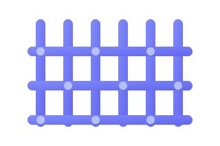
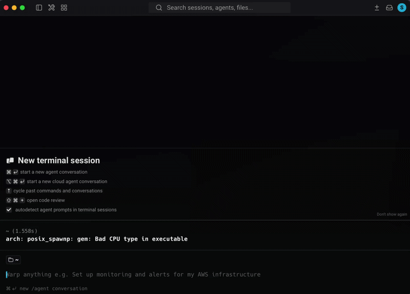
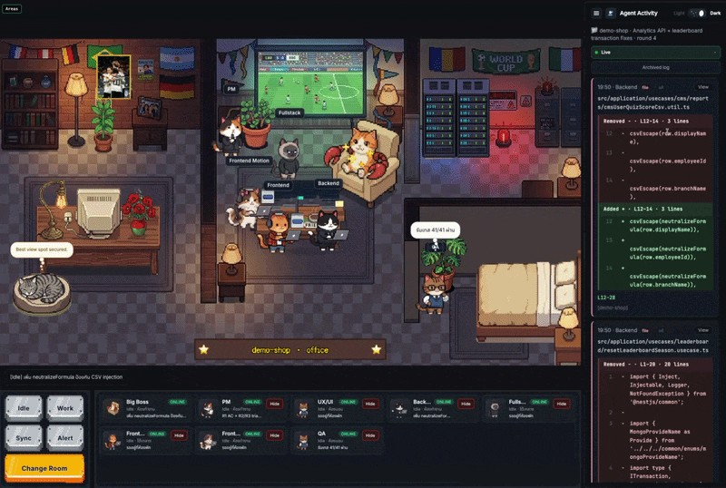
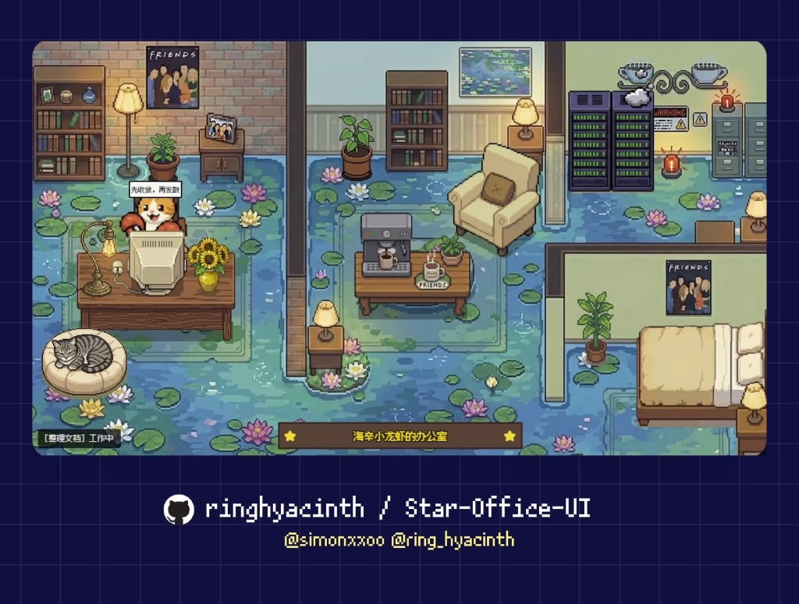

<p align="center">
  
</p>

<h1 align="center">Loom</h1>

<p align="center"><strong>AI Agent Software Team</strong> — plan → build → verify loops</p>

<p align="center">
  
  
</p>

> **English** · [ไทย](README-TH.md) · **[Full docs (EN)](README.full.md)** · **[เอกสารเต็ม (TH)](README-TH.full.md)**

Nine AI agents in one loop. This repo is the **blueprint (Base)** — your real app code lives elsewhere (`loop.config.json` → `services[].path`).

## Quick start

### 1. Install (once)

```zsh
git clone <repo-url> loom && cd loom
./loom wrap claude          # Claude Code — auto-bootstraps on first run
# or: zsh tools/init.sh   # full install + dashboard
```

First run writes `~/.loop-base`, syncs agents to **Claude Code · Cursor · Hermes**, and wires hooks.

**Every session** (from any folder):

```zsh
loom wrap claude
```

Shows the Loom banner + blueprint path, then launches **Claude Code with cwd = the blueprint**. Pre-starts the dashboard, then **`--agent loom-start`** + first message **`Use loom-start`**. Skip with `LOOM_WRAP_NO_START=1`.

<p align="center">
  
</p>

<p align="center">
  <em><code>loom wrap claude</code> → Claude auto-starts <code>loom-start</code> · <code>loom where</code> for blueprint status · dashboard at <code>http://localhost:19000</code></em>
</p>

### 2. Start a project

In chat (any platform):

```
Use loom-start
```

Steps: dashboard → base folder → control folder → **platform + model** → hand off.

Default models: Cursor `composer-2.5` · Claude `sonnet` · Hermes `inherit`

### 3. Run the loop

```
Use loom-orch at L1: <describe the feature or bug>
```

`L1` = plan only · `L2` = makers write code, you merge · `L3` = unattended (with safety limits)

### Platform cheat sheet

| Platform | Start | Run loop |
| -------- | ----- | -------- |
| **Claude Code** | `loom wrap claude` then `Use loom-start` | `Use loom-orch at L1: …` |
| **Cursor** | Open this repo → `Use loom-start` | `Use loom-orch at L1: …` |
| **Hermes** | `/loom-start` | `/loom-orch` |

Pick **one** platform — you do not need all three.

## Dashboard

`loom wrap claude` starts the central board in the background. Re-open anytime:

```zsh
loom where          # blueprint path + active project
loom dash serve     # open http://localhost:19000
```

<p align="center">
  <picture>
    <source srcset="assets/loom-dashboard-show.gif" type="image/gif">
    
  </picture>
</p>

<p align="center">
  <em>Live board — pixel office + Loop Activity panel. Office UI from <a href="https://github.com/ringhyacinth/Star-Office-UI">Star-Office-UI</a>.</em>
</p>

## Daily commands

```zsh
loom where              # blueprint + active project
loom dash serve         # dashboard → http://localhost:19000
zsh tools/refresh.sh    # after git pull — sync agents
```

## Three-layer architecture

Loom splits **team** (shared) from **job config** (per project) from **real code** (your repos):

```
Base (this repo)          Control folder              Real code
─────────────────         ─────────────────           ─────────────────
agents · tools ·          loop.config.json            services[].path
dashboard                 STATE.md                    → FE/BE anywhere
(never copy)              (1 job = 1 folder)          on disk
```

| Layer | Where | What | Think of it as |
| ----- | ----- | ---- | -------------- |
| **Base** | this `loom` repo | `.claude/agents/`, `tools/`, `agent-dashboard/` | The **team + toolbox** — shared by every job; installed machine-wide via `~/.loop-base` |
| **Control** | `~/Documents/coding/agent-build/<job>/` | `loop.config.json` + `STATE.md` only | One **job's desk** — which services to touch, autonomy, loop memory |
| **Code** | paths in `services[]` | your frontend / backend repos | Where agents **actually edit** — can be subfolders, separate repos, or absolute paths |

**Base folder vs control folder**

| | **base folder** | **control folder** |
| --- | --- | --- |
| Question | Where do *all* jobs live? | Which *job* am I running? |
| Example | `~/Documents/coding/agent-build` | `~/Documents/coding/agent-build/shop` |
| Holds | many job folders (no config here) | one `loop.config.json` + `STATE.md` |

One control folder can list **many services** (e.g. `web` + `api`) in a single config. Service `path` may be relative (under the control folder) or absolute (`~/…` / `/Users/…`) for legacy code elsewhere.

**Key rules**

- Never write `loop.config.json` inside Base — `loom-start` creates control folders under the base folder
- Agents sync to `~/.claude/agents` / `~/.cursor/agents` / `~/.hermes/skills` — not copied per project
- `.active-project` in Base points at the control folder you're working on

→ Deeper dive: [Full README — Three-layer architecture](README.full.md#three-layer-architecture)

## Agent team (short)

| Agent | Role |
| ----- | ---- |
| `loom-start` | Pick/create project — **start here** |
| `loom-orch` | Orchestrator — runs the loop |
| `loom-pm` | Requirements + AC |
| `loom-ux-ui` | UX/UI spec |
| `loom-fe` / `loom-motion` | Frontend / 3D & motion |
| `loom-be` / `loom-full-stack` | Backend / data & security |
| `loom-qa` | Tests + PASS/FAIL |

## After `git pull`

```zsh
zsh tools/refresh.sh
Use loom-start                    # legacy projects → model gate once
zsh "$(cat ~/.loop-base)/tools/apply-agent-model.sh"   # from control folder
```

Reload Cursor: **Cmd+Shift+P** → **Developer: Reload Window**

## Credits & acknowledgments

### Dashboard — [Star-Office-UI](https://github.com/ringhyacinth/Star-Office-UI)

<p align="center">
  <a href="https://github.com/ringhyacinth/Star-Office-UI">
    
  </a>
</p>

<p align="center">
  <strong><a href="https://github.com/ringhyacinth/Star-Office-UI">Star-Office-UI</a></strong>
  by <a href="https://github.com/ringhyacinth">Ring Hyacinth</a>
  &amp; <a href="https://x.com/simonxxoo">Simon Lee</a>
  — MIT code; art assets <strong>non-commercial learning use only</strong>.
  Loom vendors and customizes it under <code>agent-dashboard/star-office/</code>
  (Loop Activity panel, agent bridge, activity feed).
</p>

### External skills & libraries

| Credit | Source |
| ------ | ------ |
| **ponytail** (review / audit) | [DietrichGebert/ponytail](https://github.com/DietrichGebert/ponytail) |
| **loom-me** (PM workflow grilling) | [mattpocock/skills — loop-me](https://github.com/mattpocock/skills/tree/main/skills/in-progress/loop-me) |
| **ui-ux-pro-max** | [nextlevelbuilder/ui-ux-pro-max-skill](https://github.com/nextlevelbuilder/ui-ux-pro-max-skill) |
| **hexagonal-architecture** | [affaan-m/ECC](https://github.com/affaan-m/ECC/blob/main/skills/hexagonal-architecture/SKILL.md) |
| **qa-browser** | [browser-use/browser-use](https://github.com/browser-use/browser-use) |
| **docker-containerization** | [ailabs-393/ai-labs-claude-skills](https://skills.sh/ailabs-393/ai-labs-claude-skills/docker-containerization) |
| **pm-skills** | [phuryn/loom-pm-skills](https://github.com/phuryn/loom-pm-skills) |

Loop methodology → [LOOP.md](LOOP.md) · [Loop Engineering Guide 2026](https://tosea.ai/blog/loop-engineering-ai-agents-complete-guide-2026)

Full skill list → [Full README — Credits](README.full.md#credits--acknowledgments)

---

**Need more?** Architecture, `loop.config.json`, legacy code, skills, upgrading → **[Full README (EN)](README.full.md)** · **[เอกสารเต็ม (TH)](README-TH.full.md)**
