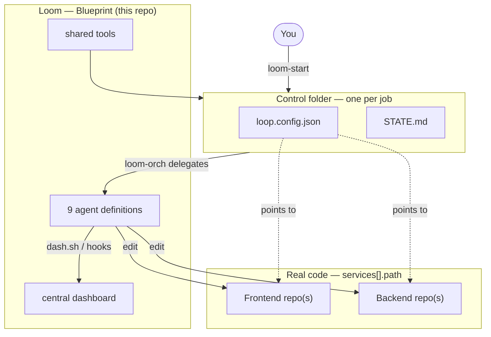
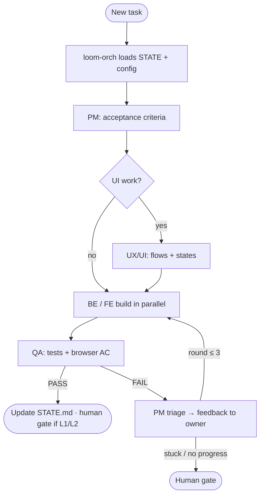
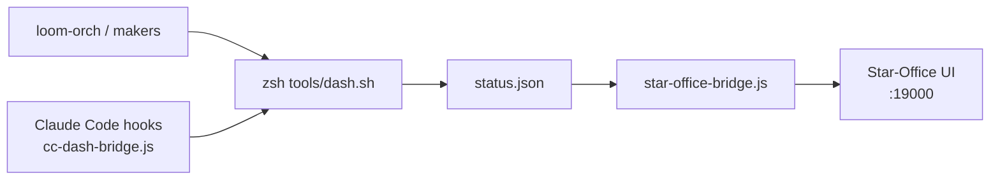

<p align="center">
  
</p>

<h1 align="center">Loom</h1>

<p align="center"><strong>AI Agent Software Team</strong> — central blueprint for plan → build → verify loops</p>

<p align="center"><em>Nine agents. One thread. Keeps weaving until it ships.</em></p>

<p align="center">
  
  
  
</p>

> **Language:** English (this document) · [ไทย](README-TH.md)
>
> **Workspace:** clone or open this repo as **`loom`** (the blueprint — not your app code).

A team of **9 AI agents** working in a **loop** (plan → build → verify → iterate). Works on **Claude Code · Cursor · Hermes**.

> This repo is the **blueprint (Base)** — not where your real project code lives.
> Real code lives at `services[].path` in `loop.config.json` (relative or absolute).
> Control folders (config + STATE) are created at `<base-dir>/<name>`, default `~/Documents/coding/agent-build`.

**Why “Loom”?** Like Hermes carries messages and Ponytail trims code to the bone, **Loom** is where software loops get *woven* — plan, build, verify, repeat — with a team of agents on one thread. Short name for the blueprint; your real apps still live in control folders and service paths.

---

## Three-layer architecture

| What | **Base** (this repo) | **Control folder** (`<base-dir>/<name>`) |
| ---- | -------------------- | ------------------------------------------ |
| **Role** | Blueprint — shared by all jobs | One job — config + memory only |
| **Agent team** | `.claude/agents/` | — (installed machine-wide via `deploy.sh`) |
| **Hermes skills** | `hermes-skills/` | — |
| **Shared tools** | `tools/` | — (call Base via `~/.loop-base`) |
| **Dashboard** | `agent-dashboard/` | — |
| **Job config** | — | `loop.config.json` — services, mode, autonomy |
| **Loop memory** | — | `STATE.md` — resumable between sessions |
| **Application code** | — | `services[].path` — may live elsewhere on disk |

| Layer              | Location              | Contents                                                                        |
| ------------------ | --------------------- | ------------------------------------------------------------------------------- |
| **Base**           | this repo             | agent definitions, tools, dashboard, LOOP.md — **never copied to destinations** |
| **control folder** | `<base-dir>/<name>`   | `loop.config.json` + `STATE.md` only                                            |
| **real code**      | per `services[].path` | frontend / backend the agents edit (may be separate repos)                      |


**Key rules**

- Never create a project or write `loop.config.json` inside Base / the current directory
- Agents install machine-wide (`~/.claude/agents`, `~/.hermes/skills`) → usable from any project
- tools + dashboard resolve Base via `~/.loop-base` (written by `deploy.sh` or `new-project.sh`)
- 1 job = 1 control folder = 1 separable session
- `.active-project` in Base stores the active control folder path (`loom-start` writes it)

**Custom base folder** via `loom-start` or env `BASE_DIR=/path`
Resolution order: arg > `BASE_DIR` > `.base-dir` file in Base > default `~/Documents/coding/agent-build`
Must be an absolute path outside Base.

### Base folder vs control folder


|                  | **base folder**                     | **control folder**                                   |
| ---------------- | ----------------------------------- | ---------------------------------------------------- |
| **Question**     | Where do **all jobs** live?         | Which **job** to open inside it?                     |
| **Example path** | `~/Documents/coding/agent-build`    | `~/Documents/coding/agent-build/shop`                |
| **Contents**     | A “shelf” for many jobs (no config) | That job's `loop.config.json` + `STATE.md`           |
| **Count**        | Usually **one** per machine         | **Many** jobs — one folder each                      |
| **services**     | N/A                                 | One control can hold **many services** in one config |


```
Use loom-start / /loom-start

Step 1 — base folder (job shelf)
  Ask path → mkdir -p if it doesn't exist yet
  ~/Documents/coding/agent-build/          ← ★ creates base folder here (if missing)

Step 2 — control folder (one job)
  2a open existing → no new folder (pick from list under base)
  2b create new    → ★ creates control folder + loop.config.json + STATE.md
    ├── shop/          ← control job A
    ├── portal/        ← control job B
    └── my-app/        ← control job C

Step 3 — lock target (.active-project in Loom) — no new folder
```


| `loom-start` step         | What gets created?                                   | Example                                         |
| ------------------------- | ---------------------------------------------------- | ----------------------------------------------- |
| **Step 1**                | **base folder** (if missing)                         | `mkdir -p ~/Documents/coding/agent-build`       |
| **Step 2a** open existing | Nothing — pick a control that already has config     | select `shop/` from the list                    |
| **Step 2b** create new    | **control folder** + `loop.config.json` + `STATE.md` | `mkdir -p …/agent-build/shop` then write config |
| **Step 3**                | `.active-project` in Loom (Blueprint) only           | no job folder created                           |


> **Blueprint (Base = this Loom repo)** is NOT created by `loom-start` — clone the repo and run `deploy.sh` once.

**How base affects control**


| Topic                       | Base matters?                                                  |
| --------------------------- | -------------------------------------------------------------- |
| Create new control folder   | Yes — always `<base>/<job-name>/`                              |
| List jobs in `loom-start`   | Yes — scans `base/*/loop.config.json`                          |
| `loop.config.json` contents | No — services / mode / paths live in control, not tied to base |
| **relative** service paths  | No — resolved from **control folder**, not base                |
| **absolute** service paths  | No — can point anywhere on disk                                |
| Change base later           | Old jobs don't move — controls stay at their original paths    |


> **control folder ≠ 1 service** — one control can list many services (e.g. frontend + api) in a single `loop.config.json`.

---

## How it works

### System overview




### Loop cycle (one iteration)




### Live dashboard data flow

The pixel office is **[Star-Office-UI](https://github.com/ringhyacinth/Star-Office-UI)** (vendored under `agent-dashboard/star-office/`). Loom adds a bridge and activity feed on top.




---

### Example: code in one place, control in another

Suppose legacy repos live under `~/Documents/coding/legacy/` (code stays put):

```
~/Documents/coding/legacy/              ← real code (not base, not control)
├── shop-frontend/
├── shop-core/
├── portal-client/
├── portal-core/
└── portal-data/
```

Set **base** = `~/Documents/coding/agent-build`, create **controls** per job:

```
~/Documents/coding/agent-build/
├── shop/                               ← control job A
│   ├── loop.config.json                ← 2 services pointing back to legacy/
│   └── STATE.md
└── portal/                             ← control job B
    ├── loop.config.json                ← 3 services pointing back to legacy/
    └── STATE.md
```

`loop.config.json` for job `shop` (`mode: existing`, no code move):

```json
{
  "project": "shop",
  "mode": "existing",
  "autonomy": "L1",
  "services": [
    { "id": "frontend", "side": "fe", "path": "~/Documents/coding/legacy/shop-frontend", "stack": "" },
    { "id": "core",     "side": "be", "path": "~/Documents/coding/legacy/shop-core",     "stack": "" }
  ]
}
```

Job `portal` is another control — three services point at `portal-*` under `legacy/`.

**Why not one folder for base + control + code?**


| Approach                                                  | Result                                                                               |
| --------------------------------------------------------- | ------------------------------------------------------------------------------------ |
| control = same folder as code (`legacy/loop.config.json`) | **One job only** — write config yourself + `cd` there                                |
| Multiple jobs in one folder                               | **Not supported** — only one `loop.config.json` + `STATE.md` (config/memory collide) |
| Separate controls under base (recommended)                | Parallel sessions; switch `shop` / `portal` via `cd` or `loom-start`                 |


---

## Getting started

### 1) Install the team (once per machine) — run from Base

```zsh
zsh tools/deploy.sh
```

First command does everything:


| Step                | What it does                                                |
| ------------------- | ----------------------------------------------------------- |
| **always**          | Register `~/.loop-base` · open dashboard at `:19000`        |
| agents              | Copy subagents → `~/.claude/agents/` **if Claude detected** |
| Hermes skills       | Install team skills → `~/.hermes/skills/` **if Hermes detected** |
| **external skills** | Recommended → `~/.agents/skills/` (+ Hermes symlinks if Hermes) |
| dashboard hooks     | Auto-bridge per platform → `install-dash-hooks.sh` (see below) |
| L3 hook             | Claude Code permission auto-allow **if Claude detected**    |


**Platforms are optional — `deploy.sh` never fails if one is missing.**

Installers detect what is on your machine and **skip the rest** (exit 0, message like `(skip Cursor hooks …)`). You can use **only Claude Code, only Cursor, or only Hermes**.


| Platform        | Detected when                                              | Installed by `deploy.sh`                                      | If not present        |
| --------------- | ---------------------------------------------------------- | ------------------------------------------------------------- | --------------------- |
| **Claude Code** | `claude` CLI **or** `~/.claude/settings.json`              | `~/.claude/agents/` · CC dashboard hooks · L3 permission hook | skipped — no error    |
| **Cursor**      | `cursor` CLI **or** `~/.cursor/` folder                    | Dashboard hooks in `~/.cursor/hooks.json`                     | skipped — no error    |
| **Hermes**      | `~/.hermes/config.yaml` (run `hermes setup` first)         | Team skills · shell hooks in config · hook allowlist          | skipped — no error    |

Cursor always reads agent defs from **this repo’s** `.claude/agents/` when the folder is open — no global copy required.

**Add a platform later** (e.g. you first used Cursor, then install Hermes):

```zsh
hermes setup                              # once, if adding Hermes
zsh tools/deploy.sh                       # or: zsh tools/install-dash-hooks.sh
zsh tools/sync-agents.sh                  # refresh Hermes skills if needed
```

Restart **Claude Code / Cursor / Hermes** after hook changes.

**After `git pull`:** run `zsh tools/deploy.sh` again to refresh hook paths — safe even if you only have one platform.


Skip external skills (no network / install later):

```zsh
DEPLOY_SKIP_EXTERNAL_SKILLS=1 zsh tools/deploy.sh
```

Install external skills later or retry after skip:

```zsh
zsh tools/install-external-skills.sh && zsh tools/install-hermes-skills.sh
```

**External skills installed by deploy**


| skill                     | Used by    | Purpose                                                                                                        |
| ------------------------- | ---------- | -------------------------------------------------------------------------------------------------------------- |
| `solid`                   | fe, be     | SOLID, TDD, clean code                                                                                         |
| `ponytail`                | fe, be     | Minimum code that works                                                                                        |
| `ponytail-review`         | fe, be     | Review over-engineering / legacy orient                                                                        |
| `ponytail-audit`          | loom-orch  | Whole-service tech debt scan (when needed)                                                                     |
| `postgres-best-practices` | loom-full-stack      | DB / Postgres                                                                                                  |
| `docker-containerization` | all agents | [ailabs-393/ai-labs-claude-skills](https://skills.sh/ailabs-393/ai-labs-claude-skills/docker-containerization) |
| `hexagonal-architecture`  | be, loom-full-stack  | Ports & Adapters — [affaan-m/ECC](https://github.com/affaan-m/ECC)                                             |
| `threejs-animation`       | loom-motion    | 3D / motion                                                                                                    |
| `perf-lighthouse`         | qa, fe     | Web performance audits                                                                                         |
| `qa-browser`              | qa         | Real-browser FE/UI testing                                                                                     |


After editing agent definitions, sync all platforms:

```zsh
zsh tools/sync-agents.sh    # source = .claude/agents/
```

> **⚠ Moving the Loom folder after `deploy.sh`**
>
> Install writes **absolute paths** on your machine — not relative to git:
>
> | What | Where |
> | ---- | ----- |
> | Base pointer | `~/.loop-base` |
> | Dashboard hooks (Claude Code) | `~/.claude/settings.json` → `cc-dash-bridge.js` |
> | Dashboard hooks (Cursor) | `~/.cursor/hooks.json` → `dash-bridge.js` |
> | L3 auto-approve (optional) | `~/.claude/settings.json` → `l3-permission-hook.js` |
> | Hermes shell hooks | `~/.hermes/config.yaml` → `dash-bridge.js` |
>
> If you **move or rename** the cloned `loom` repo (e.g. Desktop → Documents), those paths go stale.
> Symptoms: dashboard stays quiet, `dash.sh serve` fails, Claude hooks do nothing, wrong or missing project tags.
>
> **Fix** — from the **new** Loom location:
>
> ```zsh
> cd /path/to/loom
> zsh tools/deploy.sh
> ```
>
> Then restart **Claude Code, Cursor, and/or Hermes** so hooks reload.
>
> `git pull` alone does **not** refresh hooks — run `deploy.sh` (or at minimum `zsh tools/install-dash-hooks.sh` and rewrite `~/.loop-base`) after moving.
>
> Control folders under `agent-build/` and your real project code are **not** affected — only the blueprint install on this machine.

### 2) Start work — chat commands (primary)

**New job or resume an existing project** — same command; no manual `cd` if you're in Base:

```
Use loom-start      ← Claude Code / Cursor
/loom-start         ← Hermes
```

`loom-start` / `/loom-start` walks you through (see [base vs control](#base-folder-vs-control-folder)):


| Step   | Command                                            | What gets created                                                                  |
| ------ | -------------------------------------------------- | ---------------------------------------------------------------------------------- |
| **1**  | `Use loom-start` / `/loom-start` → ask path        | **base folder** — `mkdir -p` if missing (default `~/Documents/coding/agent-build`) |
| **2a** | pick **(1) open existing**                         | **Nothing** — select a control folder that already has `loop.config.json`          |
| **2b** | pick **(2) create new** → job name, mode, services | **control folder** at `<base>/<job-name>/` + `loop.config.json` + `STATE.md`       |
| **3**  | lock target                                        | write `.active-project` in Loom — no folder created                                |
| **4**  | hand off                                           | pass to `loom-orch`                                                                |


Summary:

1. **Step 1** — base folder (shelf) — creates the shelf folder **if missing**
2. **Step 2** — control folder — **2a** reopen existing (no create) · **2b** create new → `<base>/<job-name>/`
3. **(2b only)** mode (`new` / `existing`), autonomy (L1/L2/L3), services (id / side / path / stack)
4. Write/confirm `loop.config.json` + `STATE.md` at the control folder, then hand off to `loom-orch`

> `loom-start` always picks the right project before work begins.
> `loom-orch` checks `loop.config.json` in cwd first; if missing, reads `.active-project` (wrong-project guard).

Resume an existing session in detail → [Resume a session](#resume-a-session--reopen-a-project-you-already-set-up)

Then assign work:

```
Use loom-orch at L1: <describe feature or bug>
```

Hermes: `/loom-orch run at L1: <task>`

`loom-orch` asks **「Open the dashboard to watch agents? [Y/n]」** (default Y) before delegating to any agent — answer Y or Enter to open the browser at `http://localhost:19000`.

### 3) Terminal alternatives

```zsh
zsh tools/deploy.sh                  # install team (once per machine)
zsh tools/loom-start.sh              # wizard Steps 1–4 (base → control → lock → hand off)
zsh tools/new-project.sh my-app      # shortcut: Step 1 + 2b (--new)
zsh tools/dash.sh serve              # open central board (Star-Office)
```

`new-project.sh` creates a control folder at base — **does not copy tools/** (only `STATE.md`)
then runs `init-config.sh` from Base to ask for services.

### Can I stay in Base?

Resume details → [Resume a session](#resume-a-session--reopen-a-project-you-already-set-up)


| Action                                    | OK from Base?     | Notes                                                 |
| ----------------------------------------- | ----------------- | ----------------------------------------------------- |
| `Use loom-start` / `Use loom-orch`        | Yes               | Uses `.active-project` or skill pins target           |
| `node cfg.js`, `verify-paths`, `scaffold` | No                | Must `cd` into control folder (tools read cwd config) |
| `dash.sh serve` / `where`                 | Yes               | Central board; cwd-independent                        |
| `dash.sh set/reset/log`                   | Yes               | From Base — resolves project via `.active-project` (no `(unknown)` tag) |


---

## Agent team


| Name         | Role                 | Does                                                                               |
| ------------ | -------------------- | ---------------------------------------------------------------------------------- |
| `loom-start` | Bootstrap            | Start here — pick/create project + write `loop.config.json`, hand off to loom-orch |
| `loom-orch`  | Orchestrator         | Read `STATE.md` + `loop.config.json`, delegate team, run loop                      |
| `loom-pm`    | Product              | Break down AC · **lead triage** on QA FAIL · workflow grilling via **loom-me**     |
| `loom-ux-ui` | UX/UI                | UX/UI flow, all states before FE · **ui-ux-pro-max** design intelligence           |
| `loom-fe`    | Frontend             | UI against API, all states                                                         |
| `loom-motion`| Frontend Motion      | animation, Three.js/WebGL                                                          |
| `loom-be`    | Backend              | API, business logic, data layer                                                    |
| `loom-full-stack` | Fullstack (BE specialist) | DB design, security, deep backend escalation                              |
| `loom-qa`    | QA                   | AC → PASS/FAIL · FE/UI via `**qa-browser`** (browser-use)                          |


**Feedback loop:** QA FAIL → PM triage → feedback packet to `fe`/`be`/… → fix → QA re-test (max 3 rounds) — logged in `STATE.md` → `## Feedback history`

`**qa-browser`** is included in `zsh tools/deploy.sh` — see [step 1](#1-install-the-team-once-per-machine--run-from-base)

Full loop spec → [LOOP.md](LOOP.md) · Reference: [Loop Engineering Guide 2026](https://tosea.ai/blog/loop-engineering-ai-agents-complete-guide-2026)

---

## Platforms (Claude Code · Cursor · Hermes)


|                 | Claude Code           | Cursor                          | Hermes                |
| --------------- | --------------------- | ------------------------------- | --------------------- |
| Team shape      | subagents             | `.claude/agents` + Custom Modes | SKILL.md (slash)      |
| Install         | `zsh tools/deploy.sh` | open folder                     | `zsh tools/deploy.sh` |
| Start           | `Use loom-start`      | `Use loom-start`                | `/loom-start`         |
| Call agent      | `Use loom be to ...`       | chat / Custom Mode              | `/loom-be`, `/loom-qa`, …       |
| Parallel work   | full (worktree)       | limited                         | yes (subagents)       |
| Automation/cron | via loop              | —                               | built-in              |
| Strength        | full loop             | hands-on edit/review            | headless + scheduling |
| Dashboard hooks | `~/.claude/settings.json` | `~/.cursor/hooks.json`      | `~/.hermes/config.yaml` |
| Required for Loom | optional (any one)  | optional (any one)              | optional (any one)    |


### Dashboard auto-bridge (all platforms)

One command wires every **detected** platform to the central board (`http://localhost:19000`):

```zsh
zsh tools/install-dash-hooks.sh   # included in deploy.sh — skips missing platforms
```

| Platform      | Hook file / config              | What mirrors to the board |
| ------------- | ------------------------------- | ------------------------- |
| Claude Code   | `~/.claude/settings.json`       | file edits · labeled shell · sub-agent / stop summaries |
| Cursor        | `~/.cursor/hooks.json`          | above + `afterFileEdit` · `afterShellExecution` · assistant responses |
| Hermes        | `~/.hermes/config.yaml`         | `write_file` / `patch` / `terminal` · sub-agent stop · turn end (`post_llm_call`) |

Project tag resolves from cwd `loop.config.json`, parent walk, or `.active-project` in Loom — never `(unknown)`.

Shell activity shows **human-readable labels only** (e.g. `npm test`) — not raw debug commands.

Long loop summaries still benefit from explicit `dash.sh report` / `say` on all platforms.

After install → **restart** the IDE or Hermes. Hermes gateway/cron: `hermes --accept-hooks` or `hooks_auto_accept: true` in config (allowlist is pre-seeded by install).


### Claude Code

`deploy.sh` copies subagents to `~/.claude/agents/` when Claude is detected — usable in every project immediately.

```
Use loom-start
Use loom-orch at L1: ...
Use loom be to ...
Use loom qa to ...
```

**Capabilities:** native subagents — parallel worktrees, context handoff, L1–L3 autonomy. Best full-loop experience.

### Cursor

Open the folder — Cursor reads `.claude/agents/` automatically.
Optional personas: Settings → Custom Modes → paste each `.claude/agents/*.md`.

Chat like Claude Code (`Use loom-orch at L1: ...`) or switch Custom Modes.

**Capabilities:** great for interactive edits; less parallel fan-out than Claude Code. Good for hands-on fix/review.

### Hermes

When Hermes is detected, `deploy.sh` installs team skills (`loom-start loom-orch loom-pm loom-ux-ui loom-fe loom-motion loom-be loom-full-stack loom-qa LOOM`)
to `~/.hermes/skills/` with external skill symlinks.

```
/loom-start
/loom-orch
/loom-be
/loom-qa
```

Bundle skills:

```zsh
hermes bundles create backend-dev -s be -s loom-full-stack -s postgres-best-practices
hermes bundles create frontend-dev -s fe -s loom-motion -s solid
```

> `**qa` name clash:** team agent `qa` vs browser-use skill `qa` → installer exposes browser-use as `**qa-browser`** in Hermes.

**Capabilities:** autonomous/headless, cron, multi-channel. Good for scheduled loops (e.g. morning triage). Must run from / point at the right control folder.

> All three platforms read `loop.config.json` from the **folder you're in**. Start with `loom-start` to pin the right project. **You do not need all three** — pick one.

---

## loop.config.json

Don't create this in Base — `loom-start` or
`zsh "$(cat ~/.loop-base)/tools/init-config.sh"` (from control folder) walks you through it.
One job can have many services; **each service can live at its own base path**.

```json
{
  "project": "my-app",
  "mode": "new",
  "autonomy": "L1",
  "services": [
    { "id": "web",     "side": "fe", "path": "web",                        "stack": "nextjs" },
    { "id": "admin",   "side": "fe", "path": "apps/admin",                 "stack": "vite-react" },
    { "id": "api",     "side": "be", "path": "api",                        "stack": "nestjs" },
    { "id": "billing", "side": "be", "path": "/Users/me/work/billing-svc", "stack": "node-express" }
  ]
}
```

### `services[]` fields


| field   | Meaning                                                                           | Examples                                                                                                        |
| ------- | --------------------------------------------------------------------------------- | --------------------------------------------------------------------------------------------------------------- |
| `id`    | Short unique name for commands like `scaffold-all.sh api`                         | `web`, `admin`, `api`, `worker`                                                                                 |
| `side`  | Which agents own it                                                               | `fe` = frontend/UI (fe, loom-motion) · `be` = backend/API/data (be, loom-full-stack)                                          |
| `path`  | Code location — **relative** = under control folder · **absolute/`~`** = anywhere | `web`, `apps/admin`, `~/Documents/coding/legacy/old-api`                                                        |
| `stack` | Scaffold template                                                                 | fe: `nextjs` `vite-react` `sveltekit` `astro` · be: `nestjs` `fastapi` `node-express` `go` · `""` = no scaffold |


### `mode`


| value      | Meaning                                            |
| ---------- | -------------------------------------------------- |
| `new`      | Agents scaffold fresh folders at the given paths   |
| `existing` | Use code as-is — no scaffold (`stack` can be `""`) |


### `path` rules

- **relative** (`web`, `apps/admin`) → `<control folder>/web`, etc.
- **absolute** (`/Users/me/.../old-api`) → used as-is; can point at separate repos
- `**~`** → expanded to home
- Mix relative + absolute in one config

Check resolved paths (from control folder):

```zsh
B="$(cat ~/.loop-base)"
node "$B/tools/cfg.js" resolved
node "$B/tools/cfg.js" abspath api
node "$B/tools/cfg.js" ids fe
```

### Adding services later

Create the control folder once — `**services[]` can grow anytime**. No need to run `loom-start` again.

**How to add**

1. **Edit `loop.config.json`** — append an object to `services[]` (same shape as above)
2. **Via chat** — `Use loom-orch at L1: add service … to loop.config.json` (from control folder or Loom with `.active-project` set)

**Don't re-run `init-config.sh` casually** — the wizard overwrites the whole file; it does not merge existing services.

**After adding** (from control folder):

```zsh
B="$(cat ~/.loop-base)"
node "$B/tools/cfg.js" resolved
zsh "$B/tools/verify-paths.sh"
# mode: new + new relative path → scaffold only the new service
zsh "$B/tools/scaffold-all.sh" admin
```


| Topic               | Notes                                                |
| ------------------- | ---------------------------------------------------- |
| `id`                | Must be unique within one config                     |
| relative `path`     | Resolved from the **control folder**                 |
| absolute/`~` `path` | Can point at any existing repo — no code move        |
| `mode: existing`    | Works immediately — `stack: ""` is fine              |
| `STATE.md`          | No change needed — the loop re-reads config each run |


Full example → [loop.config.example.json](loop.config.example.json)

### Wizard prompts — how to type `path`

When running `zsh tools/new-project.sh <name>` (from Base) or
`zsh "$(cat ~/.loop-base)/tools/init-config.sh"` (in control folder), `**path`** accepts two forms (`←` = what you type):

```text
-- new service --
  service id — short name, e.g. web/admin/api (blank = done): web        ←  service name
  side — fe (frontend/UI) or be (backend/API/data) [fe]:                  ←  Enter = fe
  path — relative (under this project) or absolute (its own base) [web]:  ←  Enter = "web" (subfolder under control)
  stack hint — fe: nextjs|... / be: ...|go [nextjs]:                      ←  Enter = nextjs

-- new service --
  service id ...: api
  side ... [fe]: be                                                       ←  type be
  path ... [api]: /Users/me/Documents/coding/legacy/old-api               ←  absolute = existing folder elsewhere
  stack ... [nestjs]:                                                     ←  Enter = nestjs (be default)

-- new service --
  service id ...:                                                         ←  blank Enter = done
```

Result — mixed paths in one config:

```json
"services": [
  { "id": "web", "side": "fe", "path": "web",                                     "stack": "nextjs" },
  { "id": "api", "side": "be", "path": "/Users/me/Documents/coding/legacy/old-api", "stack": "nestjs" }
]
```

### Legacy sync — understand existing code first (`mode: existing`)

On legacy code agents have **no prior context** — `loom-orch` runs **orientation (step 0b)** before clarify/build:

1. Identify **in-scope services** from `loop.config.json` (don't scan whole repo unless needed)
2. Delegate makers (`loom-fe` / `loom-be` / `loom-full-stack`) to **read structure** — stack, entry points, tests, conventions
3. `**/ponytail-review`** on **files/modules this task will touch** — over-engineering / risks
4. `**/ponytail-audit`** — only when needed (huge codebase, blocking debt, or user asks); limit to relevant service folders
5. Summarize in `STATE.md` → `## Project context` + `## Relevant areas for this task`

```
loom-orch: legacy orient — shop (fe+be)
  → fe explore shop-frontend → ponytail-review on components to change
  → be explore shop-core     → ponytail-review on relevant API layer
  → write STATE.md, then PM / build
```

Requires `ponytail-review` / `ponytail-audit` — `deploy.sh` installs them — see [step 1](#1-install-the-team-once-per-machine--run-from-base)

### Autonomy levels


| Level                | Meaning                                                 |
| -------------------- | ------------------------------------------------------- |
| **L1 — report only** | Plan/propose, no commits — **start here**               |
| **L2 — assisted**    | Makers write in worktrees; you review and merge         |
| **L3 — unattended**  | Full auto when trusted — safety denylist always applies |


Move up one level when the previous feels boring (no surprises). Details in [LOOP.md](LOOP.md).

---

## Example: wrap existing folders as services (`mode: existing`)

> Folder layout (`legacy/` + controls under `agent-build/`) is [above](#example-code-in-one-place-control-in-another) — this section is full setup steps.

Legacy code under `~/Documents/coding/legacy/` — wrap folders as jobs
**without moving/copying code** — absolute `path` + `mode: existing`.

> Control folder is new under base; real code stays put.
> 1 job = 1 control folder = separable sessions.

### Job A — shop (2 services)

```zsh
zsh tools/new-project.sh shop          # new control at base, wizard mode=existing
```

```json
{
  "project": "shop",
  "mode": "existing",
  "autonomy": "L1",
  "services": [
    { "id": "frontend", "side": "fe", "path": "/Users/me/Documents/coding/legacy/shop-frontend", "stack": "" },
    { "id": "core",     "side": "be", "path": "/Users/me/Documents/coding/legacy/shop-core",     "stack": "" }
  ]
}
```

### Job B — portal, separate session (3 services)

```zsh
zsh tools/new-project.sh portal
```

```json
{
  "project": "portal",
  "mode": "existing",
  "autonomy": "L1",
  "services": [
    { "id": "client",      "side": "fe", "path": "/Users/me/Documents/coding/legacy/portal-client", "stack": "" },
    { "id": "core",        "side": "be", "path": "/Users/me/Documents/coding/legacy/portal-core",   "stack": "" },
    { "id": "data-client", "side": "be", "path": "/Users/me/Documents/coding/legacy/portal-data",   "stack": "" }
  ]
}
```

> `side` routes to the right agents (fe/loom-motion vs be/loom-full-stack) — adjust as needed.
> `stack` can be `""` for existing (no scaffold).

Verify before starting:

```zsh
cd ~/Documents/coding/agent-build/shop
B="$(cat ~/.loop-base)"
node "$B/tools/cfg.js" resolved
zsh "$B/tools/verify-paths.sh"
```

### Via skill — `/loom-start` or `Use loom-start`

No `zsh tools` required — chat step by step; skill writes `loop.config.json` (existing + absolute paths) at the control folder.

```text
You: Use loom-start                                    ← Step 1 start
loom-start: Where should projects live? [~/Documents/coding/agent-build]
You: (Enter)                                           ← Step 1: confirm base (mkdir if missing)
loom-start: Existing projects: (none) — (1) open existing  (2) create new
You: 2                                                 ← Step 2b: create new control
loom-start: Project name?
You: shop                                              ← control folder name → …/agent-build/shop/
loom-start: mode? new = scaffold / existing = use code you already have
You: existing
loom-start: autonomy? [L1]
You: (Enter)
loom-start: service — id / side / path / stack (blank = done)
You: frontend · fe · ~/Documents/coding/legacy/shop-frontend · (blank)
You: core · be · ~/Documents/coding/legacy/shop-core · (blank)
You: (blank Enter = done)                              ← Step 2b: write loop.config.json + STATE.md
loom-start: ✓ Active project → ~/Documents/coding/agent-build/shop   ← Step 3: .active-project
            wrote loop.config.json — next: Use loom-orch at L1: <task>
```

Same `loop.config.json` as job A above.

> Same outcome: `new-project.sh`/`init-config.sh` (terminal) vs `loom-start` (chat).
> Chat-only platforms (Hermes/Claude) → `/loom-start` is easiest.

### Resume a session — reopen a project you already set up

Loop memory lives in the control folder's `STATE.md` (`loop.config.json` too).
**No need to recreate** — point back at the same control folder.

#### Primary way — stay in Loom (no manual `cd`)

Open Cursor/chat in **Loom** (this blueprint repo) and type:

```
Use loom-start
```

Example conversation:

```
You:        Use loom-start                            ← Step 1 start
loom-start: Where should projects live?
You:        ~/Documents/coding/agent-build          ← Step 1: confirm base (mkdir if missing)
loom-start: Found existing projects:
              1) shop   → .../agent-build/shop
              2) portal → .../agent-build/portal
            Open existing or create new?
You:        1                                          ← Step 2a: reopen existing control (no create)
loom-start: ✓ Active project → .../agent-build/shop   ← Step 3: .active-project
            read STATE.md — continue with:
            Use loom-orch at L1: <work to resume>
You:        Use loom-orch at L1: continue from STATE — fix checkout bug
```

`loom-start` / `/loom-start` will:

- **Step 1** — create **base folder** if missing (`mkdir -p`)
- **Step 2a** — list controls under base that have `loop.config.json` — **no new folder**
- **Step 2b** — create **control folder** + config (wizard cannot be skipped)
- **Step 3** — write `.active-project` in Loom so `loom-orch` knows the active job

Continue immediately — **stay in Loom chat** because `loom-orch` reads `.active-project` when cwd has no config:

```
Use loom-orch at L1: <continue task>
```

Hermes: `/loom-orch run at L1: <task>`

#### When do you need to `cd`?


| Action                                                   | Need `cd`?                                                 |
| -------------------------------------------------------- | ---------------------------------------------------------- |
| `Use loom-start` / `Use loom-orch` in chat               | **No** — uses `.active-project`                            |
| `verify-paths`, `scaffold`, `init-config`, `node cfg.js` | **Yes** — tools read `loop.config.json` from cwd           |
| `dash.sh serve` / `where`                                | **No** — central board                                     |
| `dash.sh set/reset/log`                                  | Recommended `cd` to control — from Base uses `.active-project` instead of `(unknown)` |


Prefer opening the folder in your IDE — open the **control folder** as workspace, then `Use loom-orch` (cwd has `loop.config.json`):

```zsh
# Optional — open control as Cursor workspace
# File → Open Folder → ~/Documents/coding/agent-build/shop
# chat: Use loom-orch at L1: <task>
```

Or `cd` in terminal for manual tools:

```zsh
cd ~/Documents/coding/agent-build/shop
B="$(cat ~/.loop-base)"
zsh "$B/tools/verify-paths.sh"
```

#### Switch jobs (`shop` ↔ `portal`)

Run `Use loom-start` again → pick another control — or `cd` and invoke orch.
Every platform uses the active project's `loop.config.json` — no mixing.

#### New machine / never deployed

Once from Loom:

```zsh
zsh tools/deploy.sh    # register ~/.loop-base
```

Then `Use loom-start` as usual — control folders + `STATE.md` remain on disk at their paths.

---

## Status dashboard

One central board at Base (`agent-dashboard/`) — **never copied to destinations**
Every project/session reports here; each log line is tagged with the project name.

### Show dashboard

<p align="center">
  <picture>
    <source srcset="assets/loom-dashboard-show.gif" type="image/gif">
    
  </picture>
</p>

<p align="center">
  <em>Live board at <code>http://localhost:19000</code> — pixel office + Loop Activity panel (file diffs, reports, archived history).</em><br>
  Office UI customized from <a href="https://github.com/ringhyacinth/Star-Office-UI">Star-Office-UI</a> — see <a href="#credits--acknowledgments">Credits &amp; acknowledgments</a>.
</p>

```zsh
# Open board (from anywhere)
zsh tools/dash.sh serve          # Star-Office pixel office → http://localhost:19000
zsh tools/dash.sh where          # central board path

# Report status (from control folder for correct project tag)
B="$(cat ~/.loop-base)"
zsh "$B/tools/dash.sh" reset "<task title>"           # new task (keeps cross-project history)
zsh "$B/tools/dash.sh" set orch work "planning" "received task"
zsh "$B/tools/dash.sh" set pm   done "AC ready"
zsh "$B/tools/dash.sh" set be   work "build /auth"
zsh "$B/tools/dash.sh" loop 2                     # QA sent work back, round 2
zsh "$B/tools/dash.sh" set qa   done "PASS all criteria"
```

**Rich activity feed** — who talks to whom · which skill · which command · what they're doing:

```zsh
zsh "$B/tools/dash.sh" delegate orch pm "→ PM: write AC" activity="planning loop" skill=loom-orch
zsh "$B/tools/dash.sh" skill be ponytail activity="trimming auth handler"
zsh "$B/tools/dash.sh" cmd qa "npx playwright test" activity="regression" skill=qa-browser
zsh "$B/tools/dash.sh" event orch "route fixes" kind=delegate to=be cmd="Task be" activity="triage"
zsh "$B/tools/dash.sh" say fullstack title="core audit" kind=report --stdin <<'EOF'
TL;DR + PASS/FAIL + decisions here
EOF
```

Commands: `say` (long multiline speech) · `delegate` · `skill` · `cmd` · `event` · `log` · `set` · `clearlog`
Feed keeps 400 lines (rolling) · daily archive in `agent-dashboard/log-archive/` · **Loop Activity** panel has Clear log + archived dates

Opens on `deploy.sh` · at `loom-orch` start asks **「Open the dashboard to watch agents? [Y/n]」** (default Y) then opens the browser at `http://localhost:19000` — safe to call repeatedly.

**Star-Office dashboard** (`agent-dashboard/star-office/`) — vendored from
**[Star-Office-UI](https://github.com/ringhyacinth/Star-Office-UI)** by [Ring Hyacinth](https://github.com/ringhyacinth) & [Simon Lee](https://x.com/simonxxoo).
Code is **MIT**; **art assets are for non-commercial learning use only** (see upstream LICENSE).
Loom layers: `star-office-bridge.js`, Loop Activity panel, `dash-bridge.js` / `cc-dash-bridge.js` (Claude Code + Cursor → board), and `agent-status.js` feed commands (`file`, `report`, `wait`, …).

- `star-office-bridge.js` mirrors loop `status.json` → office + `activity.json` (`GET /activity`)
- **Loop Activity** panel shows full **say/report/test** text · readable system font · wrapped bubbles · View per message
- 8 role characters in zones (orch = main, others as guests)
- Office plaque = project name
- First run creates a small venv + installs flask

---

## Common commands

Tools live only in Base — run **from control folder** (so tools read cwd `loop.config.json`)
but point scripts at Base via `~/.loop-base`:

```zsh
cd ~/Documents/coding/agent-build/my-app      # enter control folder first
B="$(cat ~/.loop-base)"                        # Base path (written by deploy.sh)

node "$B/tools/cfg.js" resolved      # services + resolved absolute paths
node "$B/tools/cfg.js" get project   # read scalar config value
node "$B/tools/cfg.js" abspath api   # absolute path for service id=api
zsh "$B/tools/verify-paths.sh"      # check folder access / prep create (mode new)
zsh "$B/tools/scaffold-all.sh"      # scaffold all services
zsh "$B/tools/scaffold-all.sh" api  # scaffold service id=api only
zsh "$B/tools/dash.sh" serve        # open central board
zsh "$B/tools/dash.sh" where        # central board path
```

Run from Base directly (no config in cwd):

```zsh
zsh tools/deploy.sh                 # install team + register ~/.loop-base
zsh tools/loom-start.sh                 # wizard Steps 1–4
zsh tools/new-project.sh my-app       # shortcut: Step 1 + 2b
zsh tools/sync-agents.sh              # sync agent defs to all platforms
zsh tools/dash.sh serve               # open board
```

> Use **chat skills** (`loom-start`, `loom-orch`, …) or `zsh tools/*.sh` / `zsh "$B/tools/*.sh"`

---

## Credits & acknowledgments

### Dashboard

<p align="center">
  <a href="https://github.com/ringhyacinth/Star-Office-UI">
    
  </a>
</p>

<p align="center">
  <strong><a href="https://github.com/ringhyacinth/Star-Office-UI">Star-Office-UI</a></strong>
  by <a href="https://github.com/ringhyacinth">Ring Hyacinth</a>
  (<a href="https://x.com/ring_hyacinth">@ring_hyacinth</a>)
  &amp; <a href="https://x.com/simonxxoo">Simon Lee</a>
  (<a href="https://x.com/simonxxoo">@simonxxoo</a>)
</p>


| Component        | Credit                                                                                                                                                                             |
| ---------------- | ---------------------------------------------------------------------------------------------------------------------------------------------------------------------------------- |
| Pixel office UI  | **[Star-Office-UI](https://github.com/ringhyacinth/Star-Office-UI)** — [Ring Hyacinth](https://github.com/ringhyacinth) & [Simon Lee](https://x.com/simonxxoo). MIT code; art assets **non-commercial learning use only**. Loom **vendors and customizes** it under `agent-dashboard/star-office/` (Loop Activity panel, agent roles, `status.json` bridge, archived logs — see [Show dashboard](#show-dashboard)). |
| Loop integration | `star-office-bridge.js`, `agent-status.js`, `dash-bridge.js`, `cc-dash-bridge.js`, `l3-permission-hook.js` — part of this repo |


### Skills shipped with Loom (`hermes-skills/`)

Built for this team (installed to `~/.hermes/skills/` by `deploy.sh`):

`loom-start` · `loom-orch` · `loom-pm` · `loom-ux-ui` · `loom-fe` · `loom-motion` · `loom-be` · `loom-full-stack` · `loom-qa` · `LOOM`

### External skills (`tools/install-external-skills.sh`)

Installed to `~/.agents/skills/` on deploy (via `npx skills add` when available):


| Skill                                                   | Used by    | Notes                                                                                                                  |
| ------------------------------------------------------- | ---------- | ---------------------------------------------------------------------------------------------------------------------- |
| **solid**                                               | all makers | SOLID, TDD, clean code                                                                                                 |
| **ponytail** · **ponytail-review** · **ponytail-audit** | all makers | minimum correct code; review / audit — [DietrichGebert/ponytail](https://github.com/DietrichGebert/ponytail)           |
| **postgres-best-practices**                             | loom-full-stack      | Postgres guidance                                                                                                      |
| **docker-containerization**                             | all agents | [ailabs-393/ai-labs-claude-skills](https://skills.sh/ailabs-393/ai-labs-claude-skills/docker-containerization)         |
| **hexagonal-architecture**                              | be, loom-full-stack  | Ports & Adapters — [affaan-m/ECC](https://github.com/affaan-m/ECC/blob/main/skills/hexagonal-architecture/SKILL.md)    |
| **perf-lighthouse**                                     | fe         | Lighthouse audits                                                                                                      |
| **threejs-animation**                                   | loom-motion    | Three.js animation helpers                                                                                             |
| **loom-me**                                             | loom-pm    | Workflow grilling — adapted from [mattpocock/loop-me](https://github.com/mattpocock/skills/tree/main/skills/in-progress/loop-me) |
| **ui-ux-pro-max**                                       | loom-ux-ui | Design intelligence — [nextlevelbuilder/ui-ux-pro-max-skill](https://github.com/nextlevelbuilder/ui-ux-pro-max-skill)   |
| **qa** → Hermes `**qa-browser`**                        | qa         | Browser QA — [browser-use/browser-use](https://github.com/browser-use/browser-use) (`tools/install-browser-use-qa.sh`) |


### Recommended skills (install separately — referenced by agents)


| Skill                                    | Used by                | Source / install                                                    |
| ---------------------------------------- | ---------------------- | ------------------------------------------------------------------- |
| **context7**                             | fe, be, loom-motion, loom-full-stack | MCP — up-to-date library docs                                       |
| **ui-ux-pro-max**                        | design                 | Design intelligence / UI spec                                       |
| **pm-skills**                            | pm                     | [phuryn/loom-pm-skills](https://github.com/phuryn/loom-pm-skills) marketplace |
| **threejs-skills**                       | loom-motion                | CloudAI-X Three.js skill bundle                                     |
| **handoff**                              | all                    | Session / IDE continuity                                            |
| **docx** · **pdf** · **pptx** · **xlsx** | pm, design, qa, orch   | Deliverables when asked                                             |


### Methodology

Loop flow is inspired by durable-state agent loops; see [LOOP.md](LOOP.md) and [Loop Engineering Guide 2026](https://tosea.ai/blog/loop-engineering-ai-agents-complete-guide-2026).

---

## Base repo layout

```
.claude/agents/            9 agents — source of truth (Claude Code global, Cursor reads in-project)
hermes-skills/             SKILL.md for Hermes (generated via to-hermes-skills.sh)
agent-dashboard/           **central** live status board (Star-Office — all projects report here)
tools/                     only in Base — every control folder shares via ~/.loop-base
  deploy.sh                install team to Claude Code + Hermes + register Base at ~/.loop-base
  sync-agents.sh           sync agent defs to all platforms (source = .claude/agents/)
  loom-start.sh              wizard Steps 1–4: base folder → control folder → .active-project → hand off
  new-project.sh             shortcut: loom-start --new NAME (Step 1 + 2b)
  base-dir.sh              resolve destination folder (arg > BASE_DIR > .base-dir > default)
  init-config.sh           wizard writes loop.config.json (run in control folder)
  dash.sh                  talk to central board (serve / set / log) — auto-tags project name
  scaffold-all.sh · scaffold.sh   scaffold services per config (mode=new)
  cfg.js · verify-paths.sh        read config (from cwd) / verify folder access
  to-hermes-skills.sh · install-hermes-skills.sh   build + install SKILL.md for Hermes
  install-cursor-subagents.sh   sync ~/.cursor/agents + .cursor/agents; purge Cursor cache
  purge-legacy-agents.sh        one-shot cleanup for installs before v1.0.2 (see below)
LOOP.md                    loop methodology (also a skill)
STATE.template.md          loop memory template (copied to STATE.md in control folder)
loop.config.example.json   example config with _help for every field
```

---

## Upgrading from v1.0.2 and earlier (purge legacy agents)

If you installed Loom **before v1.0.2** (or before the `loom-*` agent rename), your machine may still have **old agent IDs** (`loop-start`, `loop-orch`, `pm`, `be`, `fe-anim`, …) in Claude Code, Hermes, or **Cursor Settings → Agents → Subagents**. New installs via `deploy.sh` are already clean — this section is for **existing installs only**.

### What changed

| Old ID / skill | New ID / skill |
| -------------- | -------------- |
| `loop-start` | `loom-start` |
| `loop-orch` | `loom-orch` |
| `pm` | `loom-pm` |
| `design` | `loom-ux-ui` |
| `fe` | `loom-fe` |
| `fe-anim` | `loom-motion` |
| `be` | `loom-be` |
| `be-sr` | `loom-full-stack` |
| `qa` | `loom-qa` |

Invocation examples: `Use loom-start`, `/loom-orch`, `Use loom pm to …` (see [Agent team](#agent-team)).

### One-command cleanup (recommended)

From your **Loom blueprint** repo (not a control folder):

```zsh
cd ~/Documents/coding/loom          # wherever you cloned Loom
git pull
zsh tools/purge-legacy-agents.sh
```

**Preview without deleting** (lists paths only):

```zsh
zsh tools/purge-legacy-agents.sh --dry-run
```

### What `purge-legacy-agents.sh` does

1. **Claude Code** — removes stale files under `~/.claude/agents/`:
   - Old filenames: `loop-start.md`, `tech-loop-orchestrator.md`, `designer-agent.md`, `frontend-animation-agent.md`, `backend-senior-agent.md`
   - Any `.md` whose frontmatter still says `name: loop-start`, `name: pm`, `name: be`, etc.

2. **Cursor** — removes the same stale IDs from:
   - `~/.cursor/agents/` (user-level subagents)
   - `<blueprint>/.cursor/agents/` (project-level symlinks, if present)

3. **Hermes** — removes old skill folders under `~/.hermes/skills/` (`loop-start`, `loop-orch`, `pm`, `design`, … and legacy aliases `feanim`, `besr`).

4. **Reinstall** — runs `sync-agents.sh`, which:
   - Copies current `loom-*` agents → `~/.claude/agents/`
   - Regenerates and installs Hermes skills (`loom-start` … `loom-qa`, `LOOM`)
   - Runs `install-cursor-subagents.sh` (fresh `~/.cursor/agents/`, project symlinks, clears Cursor subagent cache)

**Not touched:** `loop.config.json`, `STATE.md`, dashboard hooks, project code, or external skills in `~/.agents/skills/`.

### After the script — verify each platform

| Platform | Check | Expected |
| -------- | ----- | -------- |
| **Claude Code** | `ls ~/.claude/agents/` | 9 files (`loom-start.md`, `loom-orchestrator.md`, `pm-agent.md`, …) with `name: loom-*` in frontmatter |
| **Hermes** | `ls ~/.hermes/skills/` | `loom-start`, `loom-orch`, … `loom-qa`, `LOOM` (+ external symlinks if `deploy.sh` ran) |
| **Cursor** | Reload window, then **Settings → Agents → Subagents** | `loom-start`, `loom-orch`, `loom-pm`, `loom-ux-ui`, `loom-fe`, `loom-motion`, `loom-be`, `loom-full-stack`, `loom-qa` |

**Cursor reload:** `Cmd+Shift+P` → **Developer: Reload Window**

If Subagents still lists old names after reload, delete those entries manually (**⋯ → Delete**), reload once more. Cursor sometimes keeps a stale registry until the window restarts.

### Manual cleanup (if you prefer not to run the script)

```zsh
# Claude Code
rm -f ~/.claude/agents/{loop-start,tech-loop-orchestrator,designer-agent,frontend-animation-agent,backend-senior-agent}.md

# Hermes (full wipe of installed team skills — deploy will restore)
rm -rf ~/.hermes/skills/{loop-start,loop-orch,pm,design,fe,fe-anim,be,be-sr,qa,LOOP,feanim,besr}

# Cursor user subagents
rm -rf ~/.cursor/agents

# Then from blueprint:
zsh tools/sync-agents.sh
# or full reinstall:
zsh tools/deploy.sh
```

### Fresh install alternative

If you do not need to preserve custom hook edits, a full redeploy also works:

```zsh
cd ~/Documents/coding/loom
git pull
zsh tools/purge-legacy-agents.sh    # still recommended before deploy on old machines
zsh tools/deploy.sh
```

`deploy.sh` runs `sync-agents.sh` (which includes Cursor subagent sync) but does **not** remove old Hermes skill folder names by itself — use `purge-legacy-agents.sh` first on upgrades from v1.0.2 and earlier.

