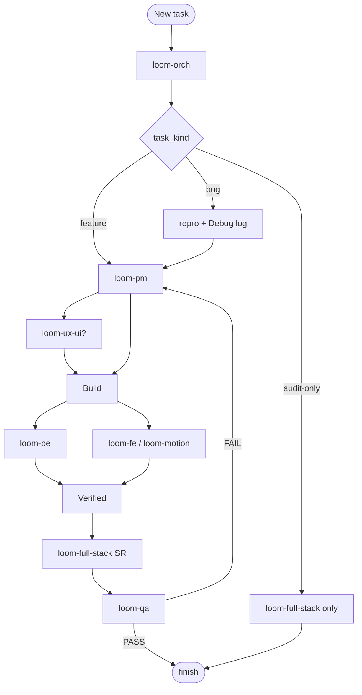

# Loom Loop Process (Process Gates)

Single source for **when** and **how** agents work — without duplicating Superpowers or extra agents.  
Orchestrator enforces these gates; makers reference **existing skills** (`solid`, `ponytail-review`, `qa-browser`).

Related: [`handoff.md`](handoff.md) · [`hexagonal-project-structure.md`](hexagonal-project-structure.md)

## Loop at a glance



> Orch delegates **loom-be** and/or **loom-fe** / **loom-motion** per `scope` — see [Task kinds](#task-kinds-statemd--task_kind) table.

---

## Task kinds (`STATE.md` → `task_kind`)

| Kind | Flow | Skip (default) |
|------|------|----------------|
| **feature** | pm → ux? → **be / fe** → SR → qa | — |
| **bug** | **debug gate** → **be or fe** fix → evidence → SR → qa | ux-ui (unless UI bug) |
| **audit-only** | fullstack L1 review | pm, be, fe, qa |

Set `scope` too: `full-stack` | `api-only` | `fe-only` | `motion-heavy` | `audit-only` (see orch agent).

---

## TDD policy (`STATE.md` or `loop.config.json` → `tdd_policy`)

| Value | When |
|-------|------|
| **`logic-only`** (default) | New use cases, bug fixes, hex slices → failing test first or RED-GREEN (`solid` skill) |
| **`off`** | UI copy, config, docs, scaffold |
| **`always`** | Team opts into strict TDD everywhere |

Ponytail still applies — no tests for trivial one-liners.

---

## Gate 1 — Evidence (`verification-before-completion`)

**No agent marks work done without proof.**

Handoff **must** include:

```markdown
- **Verified:** `npm test` → exit 0 · `npm run lint` → exit 0
```

Rules:
- Makers: run project scripts from `package.json` / `Makefile`; paste command + outcome.
- **fullstack SR:** spot-check or re-run; do not trust self-report alone.
- **qa:** PASS/FAIL only with command output or `qa-browser` evidence.

Orch rejects handoffs missing `Verified:` when makers claimed build/test success.

---

## Gate 2 — Debug (`task_kind: bug`)

Before proposing a fix, follow **Debug discipline** (embedded — no external skill required):

1. **Reproduce** — failing test, curl, or script; 1–5s deterministic signal. No repro → stop, ask user.
2. **Fail path** — debugger or trace; list knobs (env, flags, inputs); one change at a time.
3. **Falsify** — rank hypotheses; try to **disprove** before coding the fix.
4. **Breadcrumbs** — log each experiment in `STATE.md` → `## Debug log` (one line per run).

Only after repro exists → delegate maker fix. After fix → Gate 1 + SR + QA regression.

---

## Gate 3 — SR review (2 stages, `loom-full-stack`)

Separate delegation from maker work — **no self-review** same iteration.

| Stage | Checks |
|-------|--------|
| **A — Spec / contract** | AC coverage, API shapes, FE↔BE alignment, security boundaries |
| **B — Code quality** | `/ponytail-review` on diff; Part B (BE hex) / Part C (FE clean) |

Blockers → owners (`be` | `fe` | `fe-mo` | `fullstack`) → re-build → SR again.  
QA runs only after SR PASS (zero blockers).

---

## Gate 4 — Plan batches (large features)

When orch judges scope **large** (PM or user):

1. PM writes `STATE.md` → `## Plan` (steps 1…N, owners).
2. Orch runs **one batch at a time**: build → SR → optional mini-QA.
3. Update plan checkboxes before next batch.

Avoids one giant diff and context rot.

---

## Gate 5 — Finish (close iteration)

Before orch marks loop complete:

- [ ] QA PASS on every AC
- [ ] fullstack SR PASS (no blockers)
- [ ] `Verified:` evidence on record
- [ ] L2+: branch/worktree noted; human merges
- [ ] `STATE.md` updated: `## Last handoff`, `## Next action` or done
- [ ] Feedback rounds compacted if >150 lines

---

## L2+ parallel makers

When `be` + `fe` build in parallel: **isolated git worktrees** per maker when available — never two writers on same path without worktree.

---

## What we do **not** duplicate

| Need | Use instead |
|------|-------------|
| Superpowers TDD library | `solid` + `tdd_policy` |
| Superpowers code-review | fullstack SR 2-stage |
| Superpowers debugging skill | Gate 2 above |
| brainstorming skill | loom-pm + loom-ux-ui |
| Extra debug agent | bug path + makers |
